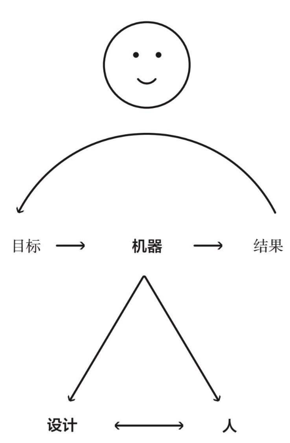

    作者: [美] 瑞·达利欧
    出版社: 中信出版社
    原作名: Principles: Life and Work
    译者: 刘波 / 綦相
    出版年: 2018-1
    页数: 576
    装帧: 精装
    ISBN: 9787508684031

[豆瓣链接](https://book.douban.com/subject/27608239/)

- [导言](#%e5%af%bc%e8%a8%80)
- [第二部分 生活原则](#%e7%ac%ac%e4%ba%8c%e9%83%a8%e5%88%86-%e7%94%9f%e6%b4%bb%e5%8e%9f%e5%88%99)
  - [拥抱现实，应对现实](#%e6%8b%a5%e6%8a%b1%e7%8e%b0%e5%ae%9e%e5%ba%94%e5%af%b9%e7%8e%b0%e5%ae%9e)
    - [做一个超级现实的人](#%e5%81%9a%e4%b8%80%e4%b8%aa%e8%b6%85%e7%ba%a7%e7%8e%b0%e5%ae%9e%e7%9a%84%e4%ba%ba)
    - [真相（或者更精确地说，对现实的准确理解）是任何良好结果的根本依据](#%e7%9c%9f%e7%9b%b8%e6%88%96%e8%80%85%e6%9b%b4%e7%b2%be%e7%a1%ae%e5%9c%b0%e8%af%b4%e5%af%b9%e7%8e%b0%e5%ae%9e%e7%9a%84%e5%87%86%e7%a1%ae%e7%90%86%e8%a7%a3%e6%98%af%e4%bb%bb%e4%bd%95%e8%89%af%e5%a5%bd%e7%bb%93%e6%9e%9c%e7%9a%84%e6%a0%b9%e6%9c%ac%e4%be%9d%e6%8d%ae)
    - [做到头脑极度开放、极度透明](#%e5%81%9a%e5%88%b0%e5%a4%b4%e8%84%91%e6%9e%81%e5%ba%a6%e5%bc%80%e6%94%be%e6%9e%81%e5%ba%a6%e9%80%8f%e6%98%8e)
    - [观察自然，学习现实规律](#%e8%a7%82%e5%af%9f%e8%87%aa%e7%84%b6%e5%ad%a6%e4%b9%a0%e7%8e%b0%e5%ae%9e%e8%a7%84%e5%be%8b)
    - [进化是生命最大的成就和最大的回报](#%e8%bf%9b%e5%8c%96%e6%98%af%e7%94%9f%e5%91%bd%e6%9c%80%e5%a4%a7%e7%9a%84%e6%88%90%e5%b0%b1%e5%92%8c%e6%9c%80%e5%a4%a7%e7%9a%84%e5%9b%9e%e6%8a%a5)
    - [理解自然提供的现实教训](#%e7%90%86%e8%a7%a3%e8%87%aa%e7%84%b6%e6%8f%90%e4%be%9b%e7%9a%84%e7%8e%b0%e5%ae%9e%e6%95%99%e8%ae%ad)
    - [痛苦+反思=进步](#%e7%97%9b%e8%8b%a6%e5%8f%8d%e6%80%9d%e8%bf%9b%e6%ad%a5)
    - [考虑后续与再后续的结果](#%e8%80%83%e8%99%91%e5%90%8e%e7%bb%ad%e4%b8%8e%e5%86%8d%e5%90%8e%e7%bb%ad%e7%9a%84%e7%bb%93%e6%9e%9c)
    - [接受结果](#%e6%8e%a5%e5%8f%97%e7%bb%93%e6%9e%9c)
    - [从更高的层次俯视机器](#%e4%bb%8e%e6%9b%b4%e9%ab%98%e7%9a%84%e5%b1%82%e6%ac%a1%e4%bf%af%e8%a7%86%e6%9c%ba%e5%99%a8)
  - [用五步流程实现你的人生愿望](#%e7%94%a8%e4%ba%94%e6%ad%a5%e6%b5%81%e7%a8%8b%e5%ae%9e%e7%8e%b0%e4%bd%a0%e7%9a%84%e4%ba%ba%e7%94%9f%e6%84%bf%e6%9c%9b)
    - [有明确的目标](#%e6%9c%89%e6%98%8e%e7%a1%ae%e7%9a%84%e7%9b%ae%e6%a0%87)
    - [找出问题，并且不容忍问题](#%e6%89%be%e5%87%ba%e9%97%ae%e9%a2%98%e5%b9%b6%e4%b8%94%e4%b8%8d%e5%ae%b9%e5%bf%8d%e9%97%ae%e9%a2%98)
    - [诊断问题，找到问题的根源](#%e8%af%8a%e6%96%ad%e9%97%ae%e9%a2%98%e6%89%be%e5%88%b0%e9%97%ae%e9%a2%98%e7%9a%84%e6%a0%b9%e6%ba%90)
    - [规划方案](#%e8%a7%84%e5%88%92%e6%96%b9%e6%a1%88)
    - [坚定地从头至尾执行方案](#%e5%9d%9a%e5%ae%9a%e5%9c%b0%e4%bb%8e%e5%a4%b4%e8%87%b3%e5%b0%be%e6%89%a7%e8%a1%8c%e6%96%b9%e6%a1%88)
  - [做到头脑极度开放](#%e5%81%9a%e5%88%b0%e5%a4%b4%e8%84%91%e6%9e%81%e5%ba%a6%e5%bc%80%e6%94%be)
    - [认识你的两大障碍](#%e8%ae%a4%e8%af%86%e4%bd%a0%e7%9a%84%e4%b8%a4%e5%a4%a7%e9%9a%9c%e7%a2%8d)
    - [奉行头脑极度开放](#%e5%a5%89%e8%a1%8c%e5%a4%b4%e8%84%91%e6%9e%81%e5%ba%a6%e5%bc%80%e6%94%be)
    - [领会并感激：深思熟虑的意见分歧](#%e9%a2%86%e4%bc%9a%e5%b9%b6%e6%84%9f%e6%bf%80%e6%b7%b1%e6%80%9d%e7%86%9f%e8%99%91%e7%9a%84%e6%84%8f%e8%a7%81%e5%88%86%e6%ad%a7)
    - [识别你应当注意的头脑封闭和头脑开放的不同迹象](#%e8%af%86%e5%88%ab%e4%bd%a0%e5%ba%94%e5%bd%93%e6%b3%a8%e6%84%8f%e7%9a%84%e5%a4%b4%e8%84%91%e5%b0%81%e9%97%ad%e5%92%8c%e5%a4%b4%e8%84%91%e5%bc%80%e6%94%be%e7%9a%84%e4%b8%8d%e5%90%8c%e8%bf%b9%e8%b1%a1)
    - [理解你如何做到头脑极度开放](#%e7%90%86%e8%a7%a3%e4%bd%a0%e5%a6%82%e4%bd%95%e5%81%9a%e5%88%b0%e5%a4%b4%e8%84%91%e6%9e%81%e5%ba%a6%e5%bc%80%e6%94%be)
  - [理解人与人大不相同](#%e7%90%86%e8%a7%a3%e4%ba%ba%e4%b8%8e%e4%ba%ba%e5%a4%a7%e4%b8%8d%e7%9b%b8%e5%90%8c)

# 导言
自己思考！

- 你想要什么？
- 事实是什么？
- 如何行动？

# 第二部分 生活原则
## 拥抱现实，应对现实
了解现实如何运行，构想我想要创造的东西，将其实现。

我学到的东西将主要来自对挫折的反思。就像长跑者忍耐痛苦去体验“跑步者的愉悦感”一样，我已经基本上走出了为犯错而痛苦的阶段，而是享受从犯错中学习的愉悦。我相信通过练习你也能改变自己的习惯，体验同样的 **“从犯错中学习的愉悦感”**。

### 做一个超级现实的人
**梦想+现实+决心=成功的生活**。

### 真相（或者更精确地说，对现实的准确理解）是任何良好结果的根本依据
当真相与愿望不符时，大多数人抗拒真相。

### 做到头脑极度开放、极度透明
对于快速学习和有效改变而言，头脑极度开放、极度透明是价值无限的。学习过程是一连串的实时反馈循环：我们做决定，看到结果，然后根据结果改进对现实的理解。做到头脑极度开放能够增强这些反馈循环的效率。

不要担心其他人的看法，使之成为你的障碍。学着做到极度透明，就像学习如何公开发言一样：一开始你会难堪，但你练得越多，你就越能应付自如。

拥抱极度求真和极度透明将带来更有意义的工作和更有意义的人际关系。这需要练习和改变人的习惯。我发现大多数习惯的改变通常需要约18个月，这也一样。

### 观察自然，学习现实规律
与动物不同，大多数人努力调和自身的情感、本能（来自人类大脑与动物相似的部分）与理性（来自人类大脑更发达的部分）。这一冲突导致人混淆了事实和自己想要的事实。

人在尝试理解任何东西（经济、市场、天气等）时，都可以从两种视角出发：

1. 自上而下：努力找到这些东西背后的唯一驱动法则或规律。例如，在理解市场时，人可以研究影响所有经济和市场的普适法则，如供求关系；在理解物种时，人可以集中了解基因密码是如何对所有物种发生作用的。
2. 自下而上：研究每种具体情况及其背后的法则或规律，例如，小麦市场独特的法则或规律，或者使鸭子区别于其他物种的基因序列。

不要固守你对事物“应该”是什么样的看法，这将使你无法了解真实的情况。多数人把对自己或者自己关心的人不利的事情叫作坏事情，而忽视了更大的好。

一个东西要“好”，就必须符合现实的规律，并促进整体的进化，这能带来最大的回报。

**进化是宇宙中最强大的力量，是唯一永恒的东西，是一切的驱动力**。

不进化就死亡。关键在于经历失败、学习和快速的改进。如果你不停地学习和改进，你的进化过程就会循环上升。

### 进化是生命最大的成就和最大的回报
进化是出于本能的，所以大多数人都会感觉到内心深处的这种动力。

自然的一个奇妙之处是，自然中充满了个体生物，各自以符合自身利益的方式行动，不理解也不引导整体的变化，但它们构成了一个美妙运转且不断进化的整体系统。

个体的激励机制必须符合群体的目标。

现实为了整体趋向最优化，而不是为了个体。

通过快速试错以适应现实是无价的。

意识到你既是一切又什么都不是，并决定你想成为什么样子。我们渺小、短命得不可思议，无论取得什么样的成就，其影响都是微不足道的。同时，我们又本能地希望有意义，希望进化，而我们只能产生一丁点儿意义。所有这些一点点的意义加起来，才是宇宙进化的推动力。

你的未来取决于你的视角。你必须决定，你将在多大程度上把他人的利益置于自身利益之上，以及你将以这样的方式对待哪些人。这是因为你将不断遇到迫使你做出上述抉择的情况。就个人而言，我现在发现，拥抱现实、从自然的视角俯视自身、做宇宙整体微不足道的一小部分，是件很美妙的事。**我本能的和有意识的目标都只是进化，利用自己的生命和特性，以某种微弱的方式为进化做贡献**。

### 理解自然提供的现实教训
当我开始从理解现实规律的视角看待现实，而不是认为现实不对时，我发现几乎所有起初看起来“不好”的东西，如雨天、缺点甚至死亡，都是由于我对于自己想要拥有的东西持有先入为主之见。我逐渐意识到，我产生这些最初的反应，是因为我没有把事物放到大背景下看待，即**现实的构造是让整体实现最优，而不是尽力实现我的愿望。**

把你的进化最大化。

这种持续地追求学习和改进的动力，让人类天生地对进步感到快乐，对快速进步感到兴奋。尽管大多数人觉得他们是在追求能让自己快乐的东西（玩具、大房子、金钱、地位等），但这些只能带来小的满足，远远无法与进步能给大多数人带去的长期的满足感相比。

记住“没有痛苦就没有收获”。虽然我们不喜欢痛苦，但自然的一切创造都有目的，所以自然让我们痛苦是有意图的。那么意图是什么？痛苦让我们清醒，帮助我们进步。

自然的一项根本法则是，为了赢得力量，人必须努力突破极限，而这是痛苦的。正像卡尔·荣格所说，“人需要困难，这对健康来说是必需的”。但多数人本能地躲避痛苦。

### 痛苦+反思=进步
如果你能养成一种习惯，面对精神痛苦时能够自动地反思痛苦而不是躲避痛苦，你将能够快速地学习和进化。

迎接而非躲避痛苦。如果你不是放任自己，而是养成习惯，总是在一定程度的痛苦中工作，你将更快地进化。养成享受痛苦的习惯，从痛苦中学习，将让人“步入新境界”。我所说的“步入新境界”是指，你将喜欢上以下三点：

- 找到、接受，并学会如何应对你的弱点；
- 更喜欢周围的人对你坦诚，而不是隐瞒对你的负面看法；
- 展现真实的自我，而不是强行把弱点伪装成优势。

接受严厉的爱。建议你不要为自己的缺点感到羞愧，要明白任何人都有缺点。把缺点摆上桌面将帮助你戒掉坏习惯，养成好习惯，获得真正的能力，拥有充足的理由保持乐观。

### 考虑后续与再后续的结果
直接结果经常是诱惑，导致我们失去真正想要的东西，直接结果有时也是障碍。

### 接受结果
不管在生活中遇到什么情况，如果你能负起责任，进行良好的决策，而不是抱怨你无法控制的东西，你将更有可能成功并找到幸福。心理学家称此为拥有`“内控点”`。

### 从更高的层次俯视机器
我把这种超越自己和其他人的处境并客观地俯视处境的能力，称为 **“更高层次的思考”**。更高层次的思考能让你学习和影响生活中的各种因果关系，利用这些因果关系得到你想要的结果。

把自己想象成一部在大机器里运转的小机器，并明白你有能力改变你的机器以实现更好的结果。你有你的目标。你用来实现目标的方式，我称为**你的机器**。它包括设计（必须做的事）和人（由谁来做这些必须做的事）。人包括你和帮助你的人。尽管合理的设计必不可少，但这只是战斗的一半。同样重要的是让合适的人来执行这些任务。

通过比较你实现的结果和你的目标，你就能确定如何改进你的机器。要看看如何改进或改变设计或人员，以实现你的目标。用图形来展示，这个过程就是一个反馈循环，参见下页图。

区别作为机器设计者的你和作为机器中工作者的你。大多数人一直都把自己看作机器中的工作者。如果你能够看到这两种角色之间的区别，并且看到成为自身生活的良好设计者与管理者要比成为机器中的工作者重要得多，你就走到了正确的道路上。想要取得成功，作为设计者和管理者的你必须客观看待作为工作者的你，不高看自己，也不让自己承担不应该承担的任务。大多数人都是凭情感行动，只看眼前，而没有从上述战略性的视角出发。他们的生活中充满了没有方向性的情感体验，随波逐流。

大多数人犯下的最大错误是不客观看待自己以及其他人，这导致他们一次次地栽在自己或其他人的弱点上。

成功的人能超越自身，客观看待事物，并管理事物以塑造改变。例如，假如作为设计者和管理者的你发现，作为工作者的你某件事情做不好，你就应该解雇这个作为工作者的你，找到一个好的替代者，而在此过程中你必须一直作为自身生活的设计者和管理者。

如果你的头脑足够开放，足够有决心，你几乎可以实现任何愿望。

## 用五步流程实现你的人生愿望
在我看来，个人进化过程（即我在上一条描述的循环）通过5个不同的步骤发生。这五步大概是：

1. 有明确的目标。
2. 找到阻碍你实现这些目标的问题，并且不容忍问题。
3. 准确诊断问题，找到问题的根源。
4. 规划可以解决问题的方案。
5. 做一切必要的事来践行这些方案，实现成果。

必须按顺序一步步来。例如，设定目标的时候就设定目标，不要想如何实现目标或者出错了怎么办。当你诊断问题的时候，不要想你将如何解决问题，只是诊断。混淆这两个步骤会导致不理想的结果，因为这会妨碍你发现真正的问题。

你必须以清醒、理性的方式来推进这个过程，从更高的层面俯视自身，做到一丝不苟的诚实。如果你被自己的情绪压倒，就退后一步，暂时停下来，直到恢复清醒的思考能力。

### 有明确的目标
排列优先顺序：尽管你几乎可以得到你想要的任何东西，但你不可能得到你想要的所有东西。

不要混淆目标和欲望。合理的目标是你真正需要实现的东西，欲望则是你想要但会阻止你实现目标的东西。欲望通常是直接结果。例如，你的目标也许是体形健美，而你的欲望是吃好吃但不健康的食物。

调和你的目标和欲望，以明确你在生活中真正想要的东西。以激情为例。没有激情的生活枯燥乏味，你不会愿意过，但关键在于如何处理自己的激情。是让激情消耗你，驱使你做出不理性的行为，还是你驾驭激情，从而得到动力来追求你真正的目标？

不要把成功的装饰误认为成功本身。有追求成就的方向感是很重要的。有的人痴迷于一双1 200美元的鞋或一辆时髦的汽车，这样的人很少会感到快乐，因为他们不知道自己真正想要的是什么，因而也不知道什么能满足他们。

如果你拥有灵活性并自我归责，那么几乎没有什么能阻止你成功。

知道如何对待挫折和知道如何前进一样重要。

### 找出问题，并且不容忍问题
把令人痛苦的问题视为考验你的潜在进步机会。

不要逃避问题，因为问题根植于看起来并不美好的残酷现实。思考难以解决的问题也许会让你焦虑，但不思考（因此不尝试解决）肯定会让你更焦虑。承认你的弱点并不是向弱点投降，而是克服弱点的第一步。

不要把问题的某个原因误认为问题本身。“我无法得到充足的睡眠”不是一个问题，而是一个问题的潜在原因（或者可能是问题的结果）。

区分大问题和小问题。你的时间和精力有限，确保你正将其用于探寻大问题，即一旦解决便能带来最大回报的问题。

找出一个问题之后，不要容忍问题。

### 诊断问题，找到问题的根源
先把问题是什么弄明白，再决定怎么做。

区分直接原因和根本原因。直接原因通常是导致问题的行动（或不行动），所以通常用动词描述（我因为没有查列车时刻表而错过了火车）。根本原因是更深层的原因，通常用形容词描述（我因为健忘而没有查列车时刻表）。只有消除根本原因才能真正解决问题，为此你必须区分症状和疾病本身。

认识到了解人（包括你自己）的特性，有助于对其形成合理预期。

### 规划方案
前进之前先回顾。

把你的问题看作一部机器产生的一系列结果。

谨记实现你的目标通常有很多途径。你只需要找出一条有效途径。

把你的方案设想为一个电影剧本，然后循序渐进地思考由谁来做什么事。然后改进。你应当从总体框架出发，一步步落实到具体任务和预计的时间线（如“在未来两周里选好能找到人才的猎头”）。无疑，在你推进的过程中，成本、时间、人员等方面的现实问题都会浮现，这将促使你进一步完善方案，直到机器里的所有齿轮都啮合良好、流畅运转。

把你的方案写下来，让所有人都能看到，并对照方案执行。

要明白，规划一个好方案不一定需要很多时间。谨记：规划先于行动！

### 坚定地从头至尾执行方案
规划做得再好，不执行也无济于事。你需要坚定地执行方案，这需要严格遵守方案的自律。你应当时刻谨记任务及其意在实现的目标之间的联系。

良好工作习惯的重要性常被大大低估。成功执行方案的人都拥有合理排序的应做事项列表，并确保每一项都有井然有序的标记。

建立清晰的衡量标准来确保你在严格执行方案。理想的做法是让其他人客观评估并报告你的进度。如果你未能实现目标，这就是另一个需要诊断和解决的问题。

成功的诀窍就是这些！

谨记，这五步中的每一步都源自你的价值观。你的价值观决定了你想要什么，即你的目标。同时谨记，这五步是层层递进的。每完成一步，你都会获得一定的信息，很可能有助于你改进其他步骤。这五步都完成后，你可以设定一个新目标，再做一遍。

## 做到头脑极度开放
### 认识你的两大障碍
**理解你的自我意识障碍**。我说的“自我意识障碍”是指你潜意识里的防卫机制，它使你难以接受自己的错误和弱点。你有一些根植于内心最深处的需求和恐惧，例如需要被爱，害怕失去别人的爱；需要生存，害怕死亡；需要让自己有意义，害怕自己无意义。这些需求都源自你大脑里的一些原始部分，如杏仁核。这些原始部分都是大脑颞叶里的构造，而颞叶处理情绪。

这些区域会简单化地处理事物，做出本能的反应。这些区域渴望赞誉，把批评视为一种攻击，尽管大脑更高级的部分能够理解，建设性的批评对你有利。

更高级的意识源于你的大脑皮层，更具体地说是在叫作“前额皮层”的部分。这是你的大脑里最具有人类特征的部分。相对于大脑的其余部分，人类的前额皮层比大多数其他物种的大。

**“两个你”在争夺对你的控制权**。如果你足够仔细地观察，你确实能看到人脑两个不同部分争吵的情况。例如，当一个人“对自己感到愤怒”时，他的前额皮层在和杏仁核（或者大脑其他较低层次的部分）争吵。当一个人问“我怎么放任自己把这一整块蛋糕都吃了”时，答案是：“因为较低层次的你战胜了深思熟虑的较高层次的你。”

**理解你的思维盲点障碍**。除了自我意识障碍之外，你（以及其他所有人）还都有思维盲点，即你的思维方式有时会阻碍你准确看待事物。

如果你跟大多数人一样，那么你就不会明白其他人看待事物的方式，也不善于探求其他人的想法，因为你一心只想着告诉对方自己认为正确的想法。换句话说，你是一个头脑封闭的人，有太多先入之见。头脑封闭的代价极为高昂：当其他人向你展示各种美妙的可能性和可怕的威胁时，你会视而不见；当其他人提出可能是建设性甚至能救命的批评时，你也不能领会。

适应和进化有三种途径：

1. 训练自己的头脑以反直觉的方式思考（例如有创造力的人通过自律和练习变得更有条理）；
2. 利用辅助机制（例如程序化的提醒器）；
3. 在自己的短板上，依靠擅长者的帮助。

在我看来，自我意识和思维盲点这两大障碍就是人的致命缺陷，导致聪颖勤奋的人无法发挥自身的全部潜力。

### 奉行头脑极度开放
要做到头脑极度开放，你必须：

1. 诚恳地相信你也许并不知道最好的解决办法是什么，并认识到，与你知道的东西相比，能不能妥善处理“不知道”才是更重要的。
2. 认识到决策应当分成两步：先分析所有相关信息，然后决定。
3. 不要担心自己的形象，只关心如何实现目标。
4. 认识到你不能“只产出不吸纳”。大多数人的情况是，与“吸纳”（学习）相比，“产出”（表达想法和制造东西）的热情似乎要高得多。
5. 认识到为了能够从他人的角度看待事物，你必须暂时悬置判断，只有设身处地，你才能合理评估另一种观点的价值。
6. 谨记，你是在寻找最好的答案，而不是你自己能得出的最好答案。
7. 搞清楚你是在争论还是在试图理解一个问题，并根据你和对方的可信度，想想哪种做法最合理。

### 领会并感激：深思熟虑的意见分歧
在深思熟虑的意见分歧中，你的目标不是让对方相信你是对的，而是弄明白谁是对的，并决定该怎么做。

### 识别你应当注意的头脑封闭和头脑开放的不同迹象
以下是一些线索，可以帮你辨别自己或其他人是否头脑封闭：

1. _头脑封闭的人_ 不喜欢看到自己的观点被挑战。他们通常会因无法说服对方而感到沮丧，而不是好奇对方为何看法不同。他们在把事情弄错时会产生坏情绪，更关心自己能不能被证明是正确的，而不是提出问题，了解其他人的观点。_头脑开放的人_ 更想了解为什么会出现分歧。当其他人不赞同时他们不会发怒。他们明白自己总有可能是错的，值得花一点时间考虑对方的观点，以确定自己没有忽略一些因素或犯错。
2. _头脑封闭的人_ 更喜欢做陈述而不是提问。尽管在特定情况下，可信度高的人有权做出陈述，但真正头脑开放的人，甚至是我认识的可信度最高的人，也经常会问很多问题。可信度低的人经常告诉我，他们的陈述其实是隐性的问题，只不过是被表述为低自信程度的陈述。尽管有时的确如此，但据我的经验，更多情况下不是。_头脑开放的人_ 真诚地相信自己可能是错的，提出真诚的问题。他们还经常权衡自己的相对可信度，以确定自己应该主要扮演学生、老师还是对等者的角色。
3. _头脑封闭的人_ 更关心是否被理解，而不是理解其他人。当对方不赞同时，他们通常会认定自己没有被理解，而不是想想是不是自己没有理解对方的观点。_头脑开放的人_ 经常觉得有必要从对方的视角看待事物。
4. _头脑封闭的人_ 会说类似这样的话：“我可能错了……但这是我的观点。”这是我经常听到的一种典型暗示。这往往是一种敷衍性的表态，人们借此来固守自己的观点，还感觉自己是开明的。如果你的陈述以这样的方式开头——“我可能是错的”或“你不一定信我的话”，那么你最好接下来提一个问题，而不是做出一个断言。_头脑开放的人_ 知道何时做陈述，何时提问。
5. _头脑封闭的人_ 阻挠其他人发言。如果在对话中一方看起来不给对方留说话空间的话，他就可能是在阻挠对方说话。为了应对这种阻挠，可以实行我之前提到的“两分钟法则”。_头脑开放的人_ 总是更喜欢倾听而不是发言。他们鼓励其他人表达观点。
6. _头脑封闭的人_ 难以同时持有两种想法。他们让自己的观点独大，挤掉别人的观点。_头脑开放的人_ 会在考虑其他人的观点的同时保留自己深入思考的能力，他们可以同时思考两个或者更多相互冲突的概念，反复权衡其相对价值。
7. _头脑封闭的人_ 缺乏深刻的谦逊意识。谦逊通常来自人的失败经历，失败让人以一种开明心态积极了解自己不知道的东西。_头脑开放的人_ 看待事物时，时刻在心底担忧自己可能是错的。

### 理解你如何做到头脑极度开放
经常利用痛苦来引导自己进行高质量的思考。如果你过于坚持一个观点，当某个人或某件事挑战该观点时，你就经常会产生心理痛苦，尤其是当相关挑战涉及你的某种缺点的时候。这种心理痛苦是一个迹象，说明你可能是错的，你需要以高质量的方式思考这个问题。为此你需要先让自己冷静下来。这可能有些难：大脑杏仁核会收缩，你也许会觉得它在踢你，你的身体会紧张，或者你的心中会涌起一种恼怒感，想发脾气。每当出现这些情绪时，你都需要注意，这些都是头脑封闭的迹象。意识到这些迹象后，你就可以将其作为线索来控制自己的行为，引导自己走向头脑开放。长期这样练习将增强你的能力，让“更高层次的你”始终处于控制地位。

将头脑开放作为一种习惯。基本上，你养成什么样的习惯，就将有什么样的生活。如果你始终把愤怒感、挫败感作为提醒自己的迹象，从而冷静，慢下来，以深思熟虑的方式看待眼前的问题，逐渐地，你的负面情绪出现的频率就会大大下降，你就会直接成为我上文描述的那种头脑开放的人。

认识自己的思维盲点。假如你是一个头脑封闭的人，又在自己有盲点的领域形成了一种观点，结果可能是致命的。所以，花点时间记录一下，你经常在哪些方面因为看不到别人看到的东西而做出糟糕的决策。可以请其他人帮你，尤其是那些曾看到你所忽略的东西的人。列一张单子，钉在墙上，仔细盯着看。每当你准备在这些方面自行做出决定（尤其是重大决定）的时候，你都要明白你是在大冒险，不会实现想要的结果。

## 理解人与人大不相同

