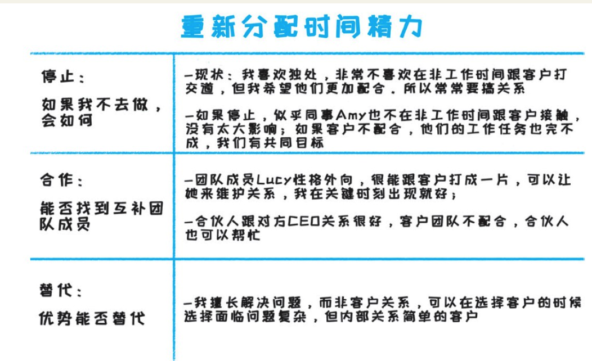
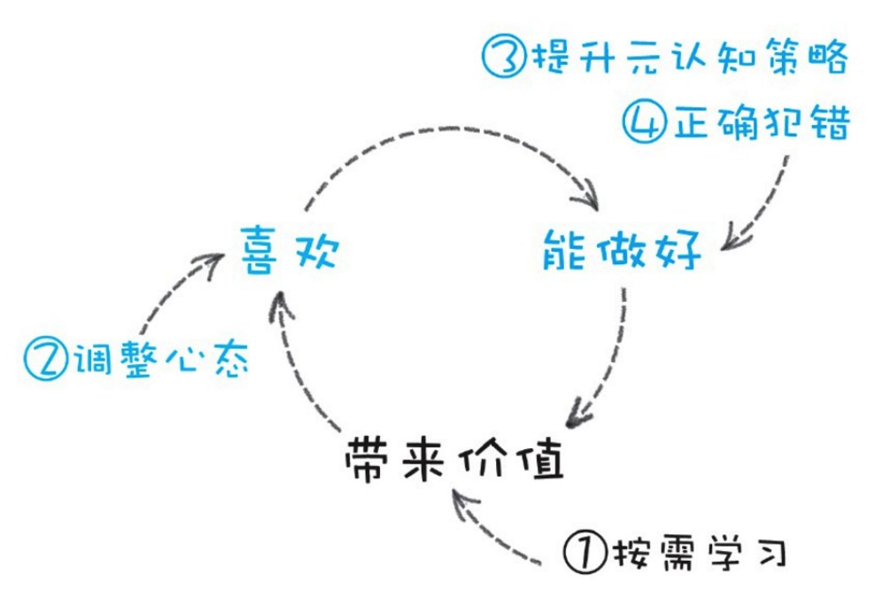
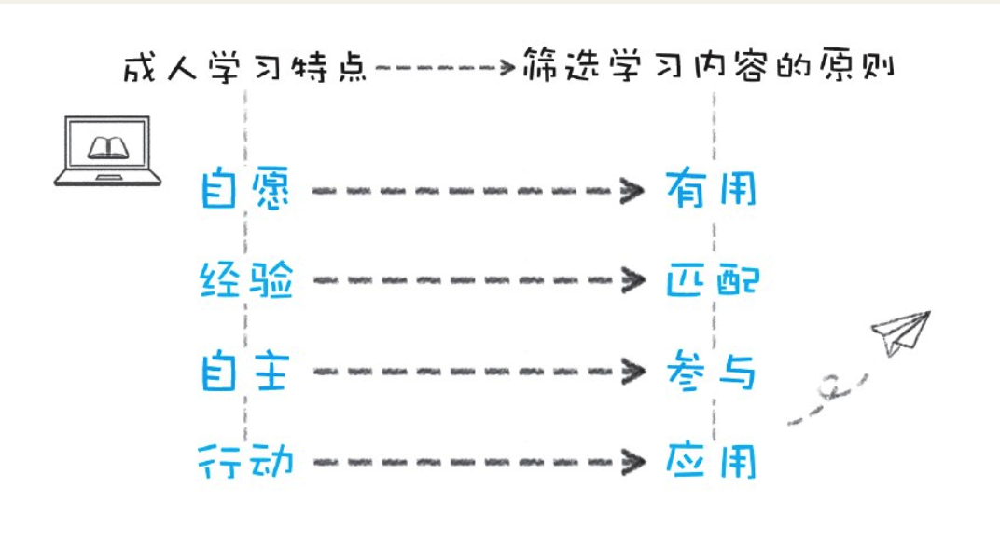
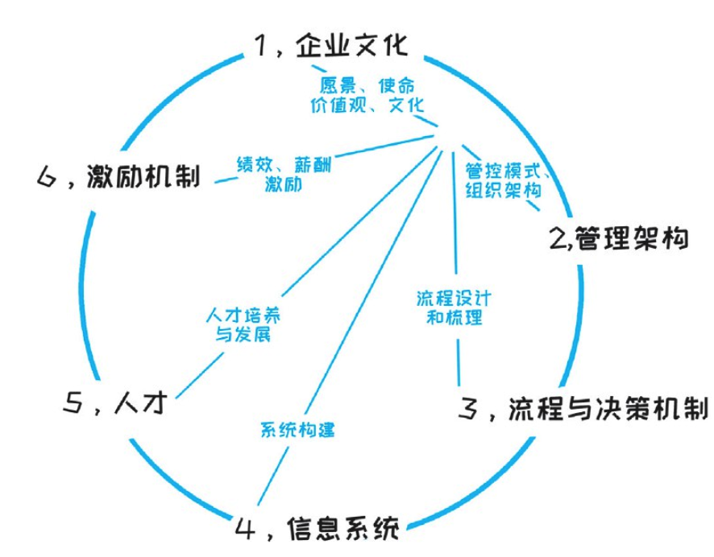

    作者: 孙圈圈 
    出版社: 团结出版社
    副标题: 如何用正确的方法快速进阶
    出版年: 2017-1-1
    页数: 296
    定价: 38.00元
    装帧: 平装
    ISBN: 9787512646759

[豆瓣链接](https://book.douban.com/subject/26936065/)

- [01 人人都有天赋 如何快速找到你的天赋优势](#01-%E4%BA%BA%E4%BA%BA%E9%83%BD%E6%9C%89%E5%A4%A9%E8%B5%8B-%E5%A6%82%E4%BD%95%E5%BF%AB%E9%80%9F%E6%89%BE%E5%88%B0%E4%BD%A0%E7%9A%84%E5%A4%A9%E8%B5%8B%E4%BC%98%E5%8A%BF)
  - [你没钱，真的不是因为不努力——找到正确的定位才是关键](#%E4%BD%A0%E6%B2%A1%E9%92%B1%E7%9C%9F%E7%9A%84%E4%B8%8D%E6%98%AF%E5%9B%A0%E4%B8%BA%E4%B8%8D%E5%8A%AA%E5%8A%9B%E6%89%BE%E5%88%B0%E6%AD%A3%E7%A1%AE%E7%9A%84%E5%AE%9A%E4%BD%8D%E6%89%8D%E6%98%AF%E5%85%B3%E9%94%AE)
    - [决定你的价值的六个因素](#%E5%86%B3%E5%AE%9A%E4%BD%A0%E7%9A%84%E4%BB%B7%E5%80%BC%E7%9A%84%E5%85%AD%E4%B8%AA%E5%9B%A0%E7%B4%A0)
    - [价值定位的五种类型](#%E4%BB%B7%E5%80%BC%E5%AE%9A%E4%BD%8D%E7%9A%84%E4%BA%94%E7%A7%8D%E7%B1%BB%E5%9E%8B)
    - [你的价值定位决定你的高度](#%E4%BD%A0%E7%9A%84%E4%BB%B7%E5%80%BC%E5%AE%9A%E4%BD%8D%E5%86%B3%E5%AE%9A%E4%BD%A0%E7%9A%84%E9%AB%98%E5%BA%A6)
  - [努力，到底是不是天赋——80%的人对天赋的理解都错了](#%E5%8A%AA%E5%8A%9B%E5%88%B0%E5%BA%95%E6%98%AF%E4%B8%8D%E6%98%AF%E5%A4%A9%E8%B5%8B80%E7%9A%84%E4%BA%BA%E5%AF%B9%E5%A4%A9%E8%B5%8B%E7%9A%84%E7%90%86%E8%A7%A3%E9%83%BD%E9%94%99%E4%BA%86)
    - [努力，到底是不是天赋](#%E5%8A%AA%E5%8A%9B%E5%88%B0%E5%BA%95%E6%98%AF%E4%B8%8D%E6%98%AF%E5%A4%A9%E8%B5%8B)
    - [天赋到结果之间，有多少条岔路](#%E5%A4%A9%E8%B5%8B%E5%88%B0%E7%BB%93%E6%9E%9C%E4%B9%8B%E9%97%B4%E6%9C%89%E5%A4%9A%E5%B0%91%E6%9D%A1%E5%B2%94%E8%B7%AF)
    - [大部分人，都在挥霍自己的天赋](#%E5%A4%A7%E9%83%A8%E5%88%86%E4%BA%BA%E9%83%BD%E5%9C%A8%E6%8C%A5%E9%9C%8D%E8%87%AA%E5%B7%B1%E7%9A%84%E5%A4%A9%E8%B5%8B)
  - [别再挥霍你的天赋了——觉得自己没天赋，是因为你没方法](#%E5%88%AB%E5%86%8D%E6%8C%A5%E9%9C%8D%E4%BD%A0%E7%9A%84%E5%A4%A9%E8%B5%8B%E4%BA%86%E8%A7%89%E5%BE%97%E8%87%AA%E5%B7%B1%E6%B2%A1%E5%A4%A9%E8%B5%8B%E6%98%AF%E5%9B%A0%E4%B8%BA%E4%BD%A0%E6%B2%A1%E6%96%B9%E6%B3%95)
    - [如何快速发现自己的天赋](#%E5%A6%82%E4%BD%95%E5%BF%AB%E9%80%9F%E5%8F%91%E7%8E%B0%E8%87%AA%E5%B7%B1%E7%9A%84%E5%A4%A9%E8%B5%8B)
      - [1.日记](#1%E6%97%A5%E8%AE%B0)
      - [2.问自己](#2%E9%97%AE%E8%87%AA%E5%B7%B1)
      - [3.问他人](#3%E9%97%AE%E4%BB%96%E4%BA%BA)
    - [将弥补劣势的时间，花到使用天赋上](#%E5%B0%86%E5%BC%A5%E8%A1%A5%E5%8A%A3%E5%8A%BF%E7%9A%84%E6%97%B6%E9%97%B4%E8%8A%B1%E5%88%B0%E4%BD%BF%E7%94%A8%E5%A4%A9%E8%B5%8B%E4%B8%8A)
    - [如何练习才能将天赋转化为能力](#%E5%A6%82%E4%BD%95%E7%BB%83%E4%B9%A0%E6%89%8D%E8%83%BD%E5%B0%86%E5%A4%A9%E8%B5%8B%E8%BD%AC%E5%8C%96%E4%B8%BA%E8%83%BD%E5%8A%9B)
- [02 学习如何学习 如何将知识转化为能力](#02-%E5%AD%A6%E4%B9%A0%E5%A6%82%E4%BD%95%E5%AD%A6%E4%B9%A0-%E5%A6%82%E4%BD%95%E5%B0%86%E7%9F%A5%E8%AF%86%E8%BD%AC%E5%8C%96%E4%B8%BA%E8%83%BD%E5%8A%9B)
  - [学习的正确姿势——靠意志力的学习，都是耍流氓](#%E5%AD%A6%E4%B9%A0%E7%9A%84%E6%AD%A3%E7%A1%AE%E5%A7%BF%E5%8A%BF%E9%9D%A0%E6%84%8F%E5%BF%97%E5%8A%9B%E7%9A%84%E5%AD%A6%E4%B9%A0%E9%83%BD%E6%98%AF%E8%80%8D%E6%B5%81%E6%B0%93)
    - [如何快乐地学习](#%E5%A6%82%E4%BD%95%E5%BF%AB%E4%B9%90%E5%9C%B0%E5%AD%A6%E4%B9%A0)
    - [按需学习才能更有动力](#%E6%8C%89%E9%9C%80%E5%AD%A6%E4%B9%A0%E6%89%8D%E8%83%BD%E6%9B%B4%E6%9C%89%E5%8A%A8%E5%8A%9B)
    - [提升元认知策略，让学习更有成就感](#%E6%8F%90%E5%8D%87%E5%85%83%E8%AE%A4%E7%9F%A5%E7%AD%96%E7%95%A5%E8%AE%A9%E5%AD%A6%E4%B9%A0%E6%9B%B4%E6%9C%89%E6%88%90%E5%B0%B1%E6%84%9F)
    - [用成就感替代挫败感](#%E7%94%A8%E6%88%90%E5%B0%B1%E6%84%9F%E6%9B%BF%E4%BB%A3%E6%8C%AB%E8%B4%A5%E6%84%9F)
  - [建立自己的知识体系——为什么你有海量信息，却解决不了现实问题](#%E5%BB%BA%E7%AB%8B%E8%87%AA%E5%B7%B1%E7%9A%84%E7%9F%A5%E8%AF%86%E4%BD%93%E7%B3%BB%E4%B8%BA%E4%BB%80%E4%B9%88%E4%BD%A0%E6%9C%89%E6%B5%B7%E9%87%8F%E4%BF%A1%E6%81%AF%E5%8D%B4%E8%A7%A3%E5%86%B3%E4%B8%8D%E4%BA%86%E7%8E%B0%E5%AE%9E%E9%97%AE%E9%A2%98)
    - [网络时代我们应学些什么](#%E7%BD%91%E7%BB%9C%E6%97%B6%E4%BB%A3%E6%88%91%E4%BB%AC%E5%BA%94%E5%AD%A6%E4%BA%9B%E4%BB%80%E4%B9%88)
    - [如何建立知识体系](#%E5%A6%82%E4%BD%95%E5%BB%BA%E7%AB%8B%E7%9F%A5%E8%AF%86%E4%BD%93%E7%B3%BB)

## 01 人人都有天赋 如何快速找到你的天赋优势
### 你没钱，真的不是因为不努力——找到正确的定位才是关键
1. 你个人能够创造出多大的价值，离不开三大`内在要素`：第一个要素，知识和技能。第二个要素。能力，比如学习和思考能力、人际交往能力等等。第三个要素，天赋，包括潜在能力、性格特质、动机、价值观。
2. 决定你最终能够收获多少回报的，除了内在因素之外，还有三大`外在因素`：出身、选择、运气。
3. 个人价值定位有五种不同的类型：投机型、知识型、技能型、能力型、天赋型。
4. 在五种不同的价值定位类型中，最优的选择有两个，一是提升能力，二是不断认识自己、发掘自己的天赋。
5. 大多数人没有采取最优选择，而是将自己定位在知识型和技能型，原因是：第一，知识和技能型最容易提升。第二，受限于岗位的定位。
6. 如果想要收入更高，你需要在学习新知识的时候，内化成能力。有技能的，需要找到稀缺技能。当然，这种稀缺性只能维持一段时间，一旦供求达到平衡之后，收入就会下降。能力，才是长久需要提升的，因为世界变化太快，只有能力是各种岗位间通用的。同时，要不断尝试和总结，发现自己的天赋。

#### 决定你的价值的六个因素
你的收入不完全是你能创造的价值，这其中，是存在一个差值的。用公式表示就是：

你的实际价值又取决于什么呢？这里有一个基础模型，称为冰山模型：

说完了内部因素，我们简单看一下外部因素。外在因素也包括三个方面：出身、选择、运气。

#### 价值定位的五种类型

刨除不可变因素，我们可以把个人所选择的定位（也可以称之为增值方式）分成五种不同的类型：投机型、知识型、技能型、能力型、天赋型。

#### 你的价值定位决定你的高度
- 投机型：追求账面价值最大化。目前的人才市场，还不是一个信息完全对称的市场。所以，同等能力，可能A 企业支付1 万，B 企业支付1.2万，C 企业支付1.5 万。投机型的人竭尽全力，通过各种渠道，找到愿意支付更高价格的地方，不惜频繁跳槽。这类人，天花板很明显，就是企业愿意为他们所支付的最高价格。
- 知识型：或许你觉得知识很值钱？但事实并非如此。为什么呢？
  - 其一，当今社会，你想知道什么，网上搜索就可以了，或者通过社交网络找到那个领域的人就可以了，可替代性太高。你就算把《百科全书》背下来，最后还得靠卖记忆力课程赚钱。
  - 其二，知识跟思维，是有差别的。现代社会，随便一个人，知识储备都超过孔子、老子、亚里士多德……但你为什么还在学他们的思想？所以，起作用的不是知识，而是思维。不能内化为能力的知识，是很难为你增加财富的。
  - 另外，你可能会想，“逻辑思维”难道不是贩卖知识吗？是的，可罗振宇能贩卖知识，靠的是他的商业运作能力。
  - 所以，**不能结合思维能力的知识，价值是很低的**。
- 技能型：技能型跟知识型其实有点类似，你能想到的最典型的技能型应该是操作工，熟练地修理仪器、操作机器。
  - 技能型的人的天花板是，企业愿意为技能付的钱，而这取决于该技能在市场上的稀缺性。
- 能力型：比如一些做专业服务类以及管理类工作的人，其定位基本是能力型的。比如咨询顾问，每天用PPT，但不会有谁是因为PPT 用得好而成为一个好顾问的。恰恰相反，一些PPT 用得一般，但能力很强的人，也没有因此太影响职业生涯。
  - 技能不行，能力可以弥补，但能力不行，技能无法代替。能力型的人，天花板往往是他们自己，而不是外在的限制。
- 天赋型：比如搞艺术、做设计的，同等努力的情况下，最终能够做得比一般人好的人，个人价值定位常常是天赋型的。

从这张图可以看出来，**想要获得更高的回报，最优的选择有两个，一是提升能力，二是不断认识自己、发掘自己的天赋**。

总之，如果想要收入更高，你需要：

1. 在学习新知识的时候，内化成能力。
2. 有技能的，需要找到稀缺技能，当然，这种稀缺性只能维持一段时间，一旦供求达到平衡之后，收入就会下降。
3. 能力，才是长久需要提升的，因为世界变化太快，只有能力是各种岗位间通用的。
4. 同时，要不断尝试和总结，发现自己的天赋。

### 努力，到底是不是天赋——80%的人对天赋的理解都错了
1. 每个人都有自己的相对天赋，正确运用天赋，可以让我们事半功倍。
2. 天赋包括`能力天赋`和`意愿天赋`，所以，在总结和反思自己的时候，要回顾这两点。
3. 能力天赋只代表潜力，要转化为能力，还需要刻意练习。
4. 正确运用天赋需要做到：找到天赋差异性大且决定性强的领域，掌握正确的刻意练习的方法，找到能有更多自主感、胜任感、归属感的工作以维持热情，坚定地拒绝那些世俗眼中的光鲜追求，避免选择那些容易埋没天赋的工作。

#### 努力，到底是不是天赋
误区一，认为天赋是能力：但实际上，天赋只是潜力。

所谓`天赋`，指的是某种天生的特性，让一个人可以在同样起点的情况下，比一般人更加快速地成长。也就是说，在某个领域内天赋高的人与该领域里的一般人，他们的努力与水平之间的关系，类似于下图两条实线。

误区二，天赋不行，努力来补：但实际上，努力也是一种天赋，天赋包括能够帮助一个人更快速成长的所有天生特性。而一个人要能够更快地成长，其实需要两个要素，一是能力方面的天赋，也可以称为潜力；二是意愿方面的天赋。

从这个角度来说，“努力也是一种天赋”这句话就有其合理性了。因为，努力代表着一种意愿，背后是由性格、动机、价值观等等来决定的，而这些都是天生的特性。

误区三，天赋离一般人很远：但实际上，每个人都有天赋。

#### 天赋到结果之间，有多少条岔路
我们就需要先来看看，天赋跟结果之间，是怎样一种关系，我用树形图来做个分解。

#### 大部分人，都在挥霍自己的天赋
挥霍方式一：用错地方。

综合这两个维度来看，你的天赋需要用在这样的领域：第一，这个领域内，是否有这项天赋，是否会导致较大的差异化；第二，该天赋是该领域的关键成功要素。

挥霍方式二：缺乏正确的方法。

一万小时天才理论中，我们往往过于关注“一万小时”，常常忽略了这一万小时的具体内容，那就是“正确的刻意练习方法”。

所以，掌握不了正确的刻意练习方法，天赋是很难变成能力的。

挥霍方式三：缺乏热情的滋养，开发动力不足。

维持刻意练习的热情，才有可能让我们一直进行这项艰辛的活动。可是，热情从哪里来呢？很多人都认为是爱好，实际上，爱好是被扭曲最多的一个概念。

热情并不来源于爱好。根据自我决定理论，热情来源于自主感、胜任感、归属感。

挥霍方式四：被世俗需求扭曲。

挥霍方式五：被后天环境埋没。

一个内容单一且每天重复的工作，会导致你主动思考能力的下降；一个流程非常规范和标准的工作，会导致你挑战和克服困难精神的丧失；一个每天跟机器打交道的工作，会导致你社交能力的减弱；一个不鼓励自主学习、主动担责的工作，会导致你失去努力的内在动力……这些，都是后天工作环境对一个人能力的影响。

### 别再挥霍你的天赋了——觉得自己没天赋，是因为你没方法
1. 天赋包括能力天赋和意愿天赋，所以真正的天赋是让你感觉自己更强大的东西。
2. 天赋有四个特征，分别是自我效能、本能、成长/ 专注和满足。
3. 探索天赋有三个方法：写日记记录内在感受，问自己有关自我效能、本能、成长/ 专注和满足的问题，以及问别人关于自己的特质。
4. 将弥补劣势的时间，重新分配到最大化你的天赋上面，才能事半功倍。具体方式是，思考三个可能性：停止、合作、替代。
5. 刻意练习是指：为了掌握某种能力，有意识地付出努力，投入到某项活动中。
6. 正确的刻意练习要符合四大特征：在学习区练习、大量重复、持续获得有效反馈、专注。学习区位于舒适区和恐慌区中间，是刻意练习的最佳区域。

#### 如何快速发现自己的天赋
天赋有四个特征，简称为“SIGN”：

- 特征一，自我效能（Self-efficacy）。对自己可以完成某项工作或任务的自信程度。比如，每当面对细节琐碎的事情时，还没开始，我就觉得自己做不好，但每当要我去解决一个难题时，我会充满信心。
- 特征二，本能（Instinct）。当你还没开始做这件事的时候，你就迫不及待地想要开始了。比如，当我把整理的东西决定要开发成为课程、教给别人的时候，我会感到异常兴奋。
- 特征三，成长/ 专注（Growth）。当你做这件事的时候，你充满好奇，十分专注，时间过得很快。比如，当我为了写文章，去阅读大量相关资料的时候，一上午对我来说，就跟20 分钟一样。
- 特征四，满足（Needs）。做完这件事之后，就算感到疲劳和困倦，你依然会有满足感。比如，每次写文章的时候，我都累到不想再继续了，然而写完之后，又觉得充满了成就感。

##### 1.日记
具体做法是：找出一周时间，在这一周里，记录自己的每个瞬间，包括兴奋、有成就感、愉快的瞬间，以及沮丧、无助、反抗的瞬间。不仅仅是工作相关，还有业余生活的部分。

你需要记录的是来自于自己内在的感受，以及非欲望的部分，比如下表中所举的例子：

一周之后，你应该会得到上百个有效瞬间，然后，结合这些让你感到强大的瞬间，去对照天赋的几个特征，筛选出跟你天赋相关的瞬间，总结共性、发现天赋。

##### 2.问自己
- 第一类问题：自我效能相关
  - 你认为，自己能够教别人什么？或者，别人常常向你请教什么？
  - 你跟他人聊天的时候，倾向聊什么？以及，聊什么话题你会更有自信？
  - 你在做什么事情的时候，不会感到焦虑和担心？
- 第二类问题：本能相关
  - 你在做什么事情的时候，很少拖延？
  - 长时间休假后，你最想念工作的哪个方面、哪个内容？
  - 你宁愿放弃休息时间，也要做的事情，是什么？
- 第三类问题：成长/ 专注相关
  - 有什么事情，让你沉浸其中忘记吃饭/ 睡觉？
  - 你在做什么事情的时候，会暂时忘记刷社交网络？
  - 你在做什么事情的时候，不容易感到疲倦和厌烦？
- 第四类问题：满足相关
  - 过去的工作和生活中，有什么能让你获得巨大的成就感和满足感？

##### 3.问他人
把这些问题发给你亲近的朋友或者同事，让他们帮你回答：
- 你觉得，我身上有什么不同于别人的特质？
- 你最欣赏或者佩服我的方面是什么？
- 在你看来，我做什么事情的时候，看起来最兴奋？
- 你曾经看到我做过哪件事情，让你印象深刻？

#### 将弥补劣势的时间，花到使用天赋上

#### 如何练习才能将天赋转化为能力
什么是正确的刻意练习方法呢？它必须符合四大特征：

1. 在学习区练习
1. 大量重复
1. 持续获得有效反馈
1. 专注

## 02 学习如何学习 如何将知识转化为能力
### 学习的正确姿势——靠意志力的学习，都是耍流氓
1. 我们的学习大多是“T”字型的：在一个领域精通就可以，而其他大多数领域，学习重点更在于了解以及建立跨领域间的联系。
2. 快乐有效的学习，要满足三点：学自己喜欢的东西、能够学得好、能给我们带来价值。
3. 在学习过程中，需要做到：按需学习、调整心态、提升元认知策略、正确犯错。
4. 按需学习：选择对我们有用、与历史过往经历匹配、能让我们参与其中、并能够应用的学习内容。长期有用的东西，需要转化成短期有用；一个大的学习内容，需要拆分出对我们最有用的部分，并集中学习这个部分。
5. 不要试图用意志力坚持学习，而要从学习本身寻求快乐。把诱惑隔离开，渐渐会学习养成习惯。学习一样东西，不需要1 万小时， 20小时足矣。
6. 提升元认知策略：每个人的认知方式不同，知道自己的认知优劣势，才能够制定适合自己的学习方法。通过筹划、选择、联系、调整、追踪的五大技巧，来提升自己的学习效率。
7. 正确犯错：人类的大脑是从犯错中学习的，能否从犯错中进步，决定了犯错这件事获得的是成就感还是挫败感。

#### 如何快乐地学习
要做到持续且快乐的学习，无非以下三点：

1. 我们喜欢这个学习内容，或者学习本身。
2. 我们能够学得好，能够让自己有成就感。
3. 这种学习能够帮我们带来价值。

从这三点出发，我们就可以总结出，如何让我们快乐且有效地持续学习。我概括为四点：

1. 按需学习：学习的东西是否对现阶段有价值。
2. 调整心态：对待学习的态度，决定了我们是否会喜欢它。
3. 提升元认知策略：每个人有不同的学习风格，了解自己的风格并且调整学习方法，能够大大提高学习效率。
4. 正确犯错：人类的大脑是从犯错中学习的，能否从错误中学习，决定了我们从学习中获得的是成就感还是挫败感。

#### 按需学习才能更有动力
关于成人学习有很多研究，成人教育领导人物马尔科姆·诺斯尔斯提出了成人学习的四个特点，区别于小孩子的学习：

1. 自愿。小孩学习一般是家长安排的，我们不会允许自己的孩子不上学，但成年人是有选择的，我们可以选择不学习、只娱乐。所以，成年人的学习内容，必须让我们看到紧迫性才行。
2. 经验。小孩的脑袋是空的，他/ 她可以接受任何新事物。但成年人有自己的经验，我们在学习的时候，往往会把学习内容跟经验做个对照，决定是否接受。同时，如果学习内容超出我们的经验太多，往往我们也很难看到价值。
3. 自主。相比小孩来说，成年人有更多主见。我们接受哪些信息、哪种方式，都是有自主性的。所以，我们选择的学习，应该是能让我们有参与感，而不是说教型的。
4. 行动。如果学习的东西，我们没机会应用，或者不知道如何应用的话，我们就会忘记。不管学习的内容有多好，只要不能使用，我们最终都会觉得没有价值。

所以，综合以上四点，在选择学习内容的时候，我们需要遵循的原则是：

- 原则一——有用：对我们现阶段要有用的，这个用处不一定是工作或者赚钱，也可以是让人放松等等。
- 原则二——匹配：跟我们的经验背景相匹配的，不会太粗浅，也不会太深奥。
- 原则三——参与：能够有参与感的，说教式的学习最好不要参与。
- 原则四——应用：可以应用到行动中去的，跟我们的工作、生活相结合的。

其中，对于“有用”这个原则，我们还需要注意两点：

第一，长期有用的东西，需要把它转化成短期有用：有些学习内容，短期内就可以找到用处；而另一些学习内容，对你未来是很有用的，但现阶段看不出，所以你必须创造出一个短期价值场景。

比如你要去训练思维方式，你知道它有用，但短期之内看不到效果，而且短期之内也不能让你事业上有明显提高。

那怎么办？你必须创造出一个短期的价值场景出来。比如，我就开了个公众号，规定自己每周要写一篇文章，而且必须是写方法论类的，把它作为我学习总结、反思、应用的一种方式。

这样一来，本来思维方式的反思和学习是看不到短期作用的，所以每周去总结其实是很难做到的，但我把它写在公众号里，这时读者点赞和转发就能让我非常有成就感和价值感，收到更加即时的反馈。

这样通过把长期有用变成短期有用，就可以让自己很好地坚持了下去。

第二，大的学习内容，需拆分出有用的组成部分：学吉他，需要培养乐感、学习乐理、学习理论、练习指法，等等。但是，我学吉他并不是想成为多么顶级的吉他手，只是为了排遣和放松，那么，会几个基本和弦，然后左手会按弦和切换，右手会扫弦，其实就够了。

#### 提升元认知策略，让学习更有成就感
我们每个人基因不同、经历不同，所以认知方式都有自己的特点和习惯。有人善于反思，有人善于行动；有人擅长逻辑，有人擅长经验；有些人喜欢一个人总结的学习，有些人喜欢大家一起学习，这些都构成了我们不同的学习风格。

“元认知”这个概念可能有点抽象，打个比方来说：我学习风格比较倾向于逻辑，平时说话也是这样，如果一个东西不符合逻辑，它再有见地，我也得把它套到一个框架当中才行。

理查德· 克拉克在1998 年提出了五种元认知技巧，或许可以让我们借鉴：

- 技巧一，筹划——学习新知识时，需要分析出必须要做的事情，比如研究一个行业，重点看其宏观环境、如何盈利、人才市场等等。并且，会据此制定计划，与什么人聊天、如何寻找资源、大概什么时间去做。而元认知差的人没有特别的规划，可能就一头扎进去了。
- 技巧二，选择——元认知能力强的人可以从杂乱无章的资料里筛选出关键要素，并时刻记住自己的目标。
元认知比较差的人，通常做法是觉得每样信息都很重要，都要去学，于是很快被信息淹没。
- 技巧三，联系——寻求新旧知识之间的联系。元认知差的人不太会联想，只会不停接收，但与自己原有的经验是割裂的。
- 技巧四，调整——分析与理解新的知识，抛弃过去有用但现在不需要的信息。
- 技巧五，追踪——能理解与应用新的知识，明确局限性，不会生搬硬套。

#### 用成就感替代挫败感
通常学习有三层：

- 知识层：学习某项内容，会某个知识点；
- 能力层：超越具体的学习内容，举一反三，应用到解决问题中；
- 价值观层：建立整体的心智模型和价值体系。

### 建立自己的知识体系——为什么你有海量信息，却解决不了现实问题
1. 技术和互联网如此发达，所以我们的学习，应该不再局限于现有知识，而更多的是探索未来的能力；不再局限于知识本身，而更多的是这些知识可以解决何种问题；不再局限于某个领域，而更多的是知识之间的联系。
2. 从学习来说，分为知识、能力和价值观三类学习。这三类内容的学习方式是不同的，倘若我们没有意识到这种不同，就会出现如下误区：
    - 误区一：知识零散化，导致信息饥渴症以及信息过载。
    - 误区二：只学价值观，忽略知识和能力。
    - 误区三：将知识与能力割裂。
3. 一个完整的知识体系，应该包括三个要素：有知识架构、有知识内容、内容之间有联系。
4. 建立知识体系的步骤：明确自己的学习背景、通过各种可靠渠道建立架构、不断修正自己的知识架构、在架构中填充知识、将知识之间以及知识与问题之间进行关联。

#### 网络时代我们应学些什么
学习无外乎三个方面：知识、能力、价值观。

- 知识的学习：具体某个领域的、用来阐述道理或解释事情或完成任务的相关信息。
- 能力的学习：这里的能力是广义的，既包括特定领域的技能，比如打篮球、写程序、画插画，也包括超越具体领域的通用能力，比如思维、沟通、计划等。
- 价值观的学习：整体的心智模型和价值体系，也就是，对事物的判断。

- 误区1 ：知识零散化，导致信息饥渴症以及信息过载
  - 你发现自己陷入了碎片知识饥渴，或者明明有很多这个领域的知识，但遇到问题还是无从下手，你就该知道，不能再吸收零散信息、而必须要建立知识体系了。
- 误区2 ：只学价值观，忽略知识和能力
  - “道、术、器”，“道”在最前，然而，“道”是你积累到一定阶段才能悟出来的，倘若没有“术”和“器”，即便知道了“道”，又有什么用？
  - 我们很多时候想一步登天地掌握“道”，其实登上的只是空中楼阁。
- 误区3 ：将知识与能力割裂
  - 这种不能转化为能力的知识，学得越多，只会让你信息过载、浪费时间、感到挫败，倒不如，就选择一个知识去学习，将它真正变成你的一部分。

#### 如何建立知识体系

从以上的图我们可以看到，零散的知识吸收，是跳跃式的、点状的、相互割裂的；而有了知识体系之后的学习，是结构化的、网状的、相互关联的。

所以，一个完整的知识体系，应该包括三个要素：有知识架构、有知识内容、内容之间有联系。

那么，如何建立出这种知识体系呢？可以遵循以下方法：

方法一，明确自己的学习背景当你刚开始学习一个领域的时候，首先要明确：你为什么学习这个领域？将来打算如何应用？这个领域跟你现有的其他知识是什么关系？

比如咨询的——影响组织效率的六大方面：

比如个人提升的——个人需要具备的技术以外的能力：

个人的专业能力提升其实也一样的，讲求“T”字型，横向上，各领域都懂一点，纵向上，找到自己赖以谋生的专业领域去深挖。

方法二，通过各种可靠渠道建立架构

在建立知识架构的时候，什么是靠谱且高质的信息源呢？答案是：专家、专业网站、经典书。

方法三，不断修正自己的知识架构

每个人的背景不同、学习目的不同，最终形成的知识结构可能也不同。

方法四，在架构中填充知识

我建议的一个方法是：

- 首先，把你看到的任何有价值的信息，都记在手机里，用什么软件都无所谓。记的时候不需要组织语言，记关键词就可以，这样最快。如果是微信文章里的，你可以直接截图保存。
- 其次，每天对当天的知识进行整理，分门别类地列到某个应用，比如Evernote 里面（如果你在上一步中也是用Evernote，那你需要分开不同的文件夹）。
- 最后，定期回顾，如果是重要的知识，再记入到知识架构里，作为知识体系的一部分，当然，这也是另一个文件夹。

方法五，将知识之间、知识与问题之间进行关联

之所以在解决问题的时候想不起用什么知识，是因为知识和问题之间是脱节的。那么，如何让知识和问题链接起来呢？答案是：二者都向对方靠。

知识向问题靠：每看到一个知识的时候，就去思考这个知识可以用来解决什么问题。

问题向知识靠：遇到任何问题的时候，不要抛开过去的知识坐着苦想，而是回到你的知识体系，去查看哪个能帮你解决问题。多次之后，你就知道某类问题该用哪类知识解决了。