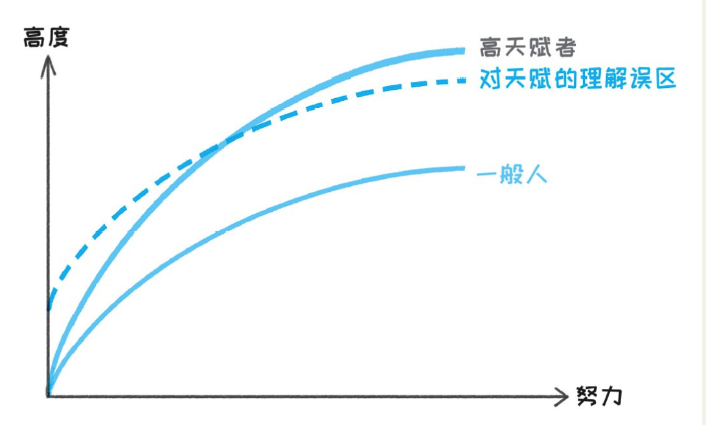
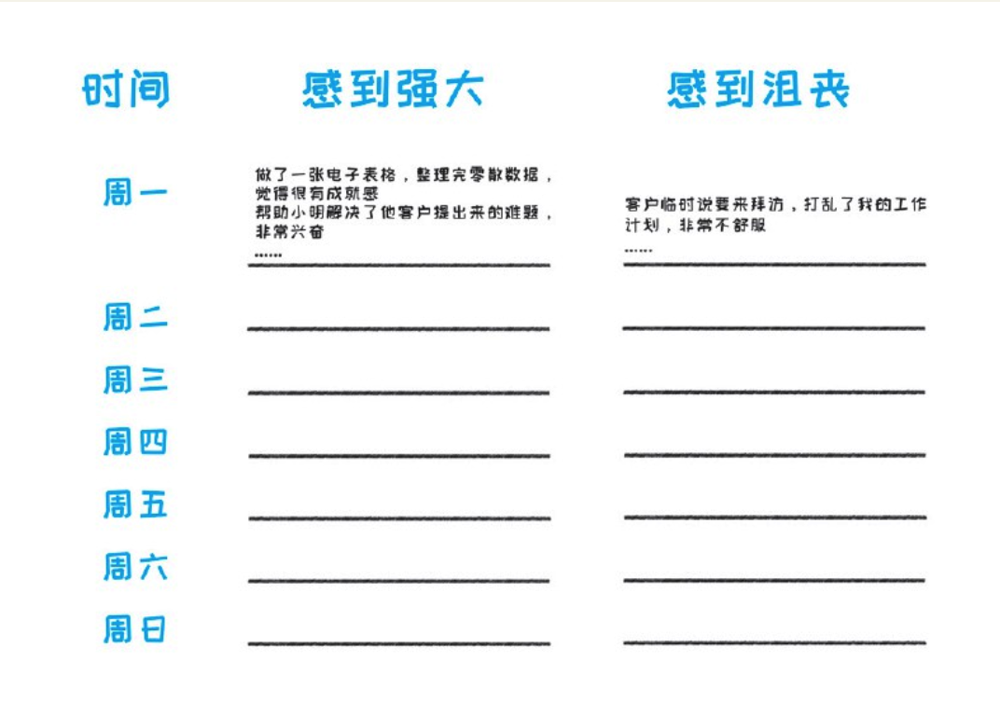

    作者: 孙圈圈 
    出版社: 团结出版社
    副标题: 如何用正确的方法快速进阶
    出版年: 2017-1-1
    页数: 296
    定价: 38.00元
    装帧: 平装
    ISBN: 9787512646759

[豆瓣链接](https://book.douban.com/subject/26936065/)

## 01  人人都有天赋  如何快速找到你的天赋优势
### 你没钱，真的不是因为不努力——找到正确的定位才是关键
1. 你个人能够创造出多大的价值，离不开三大`内在要素`：第一个要素，知识和技能。第二个要素。能力，比如学习和思考能力、人际交往能力等等。第三个要素，天赋，包括潜在能力、性格特质、动机、价值观。
2. 决定你最终能够收获多少回报的，除了内在因素之外，还有三大`外在因素`：出身、选择、运气。
3. 个人价值定位有五种不同的类型：投机型、知识型、技能型、能力型、天赋型。
4. 在五种不同的价值定位类型中，最优的选择有两个，一是提升能力，二是不断认识自己、发掘自己的天赋。
5. 大多数人没有采取最优选择，而是将自己定位在知识型和技能型，原因是：第一，知识和技能型最容易提升。第二，受限于岗位的定位。
6. 如果想要收入更高，你需要在学习新知识的时候，内化成能力。有技能的，需要找到稀缺技能。当然，这种稀缺性只能维持一段时间，一旦供求达到平衡之后，收入就会下降。能力，才是长久需要提升的，因为世界变化太快，只有能力是各种岗位间通用的。同时，要不断尝试和总结，发现自己的天赋。

#### 决定你的价值的六个因素
你的收入不完全是你能创造的价值，这其中，是存在一个差值的。用公式表示就是：

你的实际价值又取决于什么呢？这里有一个基础模型，称为冰山模型：

说完了内部因素，我们简单看一下外部因素。外在因素也包括三个方面：出身、选择、运气。

#### 价值定位的五种类型

刨除不可变因素，我们可以把个人所选择的定位（也可以称之为增值方式）分成五种不同的类型：投机型、知识型、技能型、能力型、天赋型。

#### 你的价值定位决定你的高度
- 投机型：追求账面价值最大化。目前的人才市场，还不是一个信息完全对称的市场。所以，同等能力，可能A 企业支付1 万，B 企业支付1.2万，C 企业支付1.5 万。投机型的人竭尽全力，通过各种渠道，找到愿意支付更高价格的地方，不惜频繁跳槽。这类人，天花板很明显，就是企业愿意为他们所支付的最高价格。
- 知识型：或许你觉得知识很值钱？但事实并非如此。为什么呢？
  - 其一，当今社会，你想知道什么，网上搜索就可以了，或者通过社交网络找到那个领域的人就可以了，可替代性太高。你就算把《百科全书》背下来，最后还得靠卖记忆力课程赚钱。
  - 其二，知识跟思维，是有差别的。现代社会，随便一个人，知识储备都超过孔子、老子、亚里士多德……但你为什么还在学他们的思想？所以，起作用的不是知识，而是思维。不能内化为能力的知识，是很难为你增加财富的。
  - 另外，你可能会想，“逻辑思维”难道不是贩卖知识吗？是的，可罗振宇能贩卖知识，靠的是他的商业运作能力。
  - 所以，**不能结合思维能力的知识，价值是很低的**。
- 技能型：技能型跟知识型其实有点类似，你能想到的最典型的技能型应该是操作工，熟练地修理仪器、操作机器。
  - 技能型的人的天花板是，企业愿意为技能付的钱，而这取决于该技能在市场上的稀缺性。
- 能力型：比如一些做专业服务类以及管理类工作的人，其定位基本是能力型的。比如咨询顾问，每天用PPT，但不会有谁是因为PPT 用得好而成为一个好顾问的。恰恰相反，一些PPT 用得一般，但能力很强的人，也没有因此太影响职业生涯。
  - 技能不行，能力可以弥补，但能力不行，技能无法代替。能力型的人，天花板往往是他们自己，而不是外在的限制。
- 天赋型：比如搞艺术、做设计的，同等努力的情况下，最终能够做得比一般人好的人，个人价值定位常常是天赋型的。

从这张图可以看出来，**想要获得更高的回报，最优的选择有两个，一是提升能力，二是不断认识自己、发掘自己的天赋**。

总之，如果想要收入更高，你需要：

1. 在学习新知识的时候，内化成能力。
2. 有技能的，需要找到稀缺技能，当然，这种稀缺性只能维持一段时间，一旦供求达到平衡之后，收入就会下降。
3. 能力，才是长久需要提升的，因为世界变化太快，只有能力是各种岗位间通用的。
4. 同时，要不断尝试和总结，发现自己的天赋。

### 努力，到底是不是天赋——80%的人对天赋的理解都错了
1. 每个人都有自己的相对天赋，正确运用天赋，可以让我们事半功倍。
2. 天赋包括`能力天赋`和`意愿天赋`，所以，在总结和反思自己的时候，要回顾这两点。
3. 能力天赋只代表潜力，要转化为能力，还需要刻意练习。
4. 正确运用天赋需要做到：找到天赋差异性大且决定性强的领域，掌握正确的刻意练习的方法，找到能有更多自主感、胜任感、归属感的工作以维持热情，坚定地拒绝那些世俗眼中的光鲜追求，避免选择那些容易埋没天赋的工作。

#### 努力，到底是不是天赋
误区一，认为天赋是能力：但实际上，天赋只是潜力。

所谓`天赋`，指的是某种天生的特性，让一个人可以在同样起点的情况下，比一般人更加快速地成长。也就是说，在某个领域内天赋高的人与该领域里的一般人，他们的努力与水平之间的关系，类似于下图两条实线。

误区二，天赋不行，努力来补：但实际上，努力也是一种天赋，天赋包括能够帮助一个人更快速成长的所有天生特性。而一个人要能够更快地成长，其实需要两个要素，一是能力方面的天赋，也可以称为潜力；二是意愿方面的天赋。

从这个角度来说，“努力也是一种天赋”这句话就有其合理性了。因为，努力代表着一种意愿，背后是由性格、动机、价值观等等来决定的，而这些都是天生的特性。

误区三，天赋离一般人很远：但实际上，每个人都有天赋。

#### 天赋到结果之间，有多少条岔路
我们就需要先来看看，天赋跟结果之间，是怎样一种关系，我用树形图来做个分解。

#### 大部分人，都在挥霍自己的天赋
挥霍方式一：用错地方。

综合这两个维度来看，你的天赋需要用在这样的领域：第一，这个领域内，是否有这项天赋，是否会导致较大的差异化；第二，该天赋是该领域的关键成功要素。

挥霍方式二：缺乏正确的方法。

一万小时天才理论中，我们往往过于关注“一万小时”，常常忽略了这一万小时的具体内容，那就是“正确的刻意练习方法”。

所以，掌握不了正确的刻意练习方法，天赋是很难变成能力的。

挥霍方式三：缺乏热情的滋养，开发动力不足。

维持刻意练习的热情，才有可能让我们一直进行这项艰辛的活动。可是，热情从哪里来呢？很多人都认为是爱好，实际上，爱好是被扭曲最多的一个概念。

热情并不来源于爱好。根据自我决定理论，热情来源于自主感、胜任感、归属感。

挥霍方式四：被世俗需求扭曲。

挥霍方式五：被后天环境埋没。

一个内容单一且每天重复的工作，会导致你主动思考能力的下降；一个流程非常规范和标准的工作，会导致你挑战和克服困难精神的丧失；一个每天跟机器打交道的工作，会导致你社交能力的减弱；一个不鼓励自主学习、主动担责的工作，会导致你失去努力的内在动力……这些，都是后天工作环境对一个人能力的影响。

### 别再挥霍你的天赋了——觉得自己没天赋，是因为你没方法
1. 天赋包括能力天赋和意愿天赋，所以真正的天赋是让你感觉自己更强大的东西。
2. 天赋有四个特征，分别是自我效能、本能、成长/ 专注和满足。
3. 探索天赋有三个方法：写日记记录内在感受，问自己有关自我效能、本能、成长/ 专注和满足的问题，以及问别人关于自己的特质。
4. 将弥补劣势的时间，重新分配到最大化你的天赋上面，才能事半功倍。具体方式是，思考三个可能性：停止、合作、替代。
5. 刻意练习是指：为了掌握某种能力，有意识地付出努力，投入到某项活动中。
6. 正确的刻意练习要符合四大特征：在学习区练习、大量重复、持续获得有效反馈、专注。学习区位于舒适区和恐慌区中间，是刻意练习的最佳区域。

#### 如何快速发现自己的天赋
天赋有四个特征，简称为“SIGN”：

- 特征一，自我效能（Self-efficacy）。对自己可以完成某项工作或任务的自信程度。比如，每当面对细节琐碎的事情时，还没开始，我就觉得自己做不好，但每当要我去解决一个难题时，我会充满信心。
- 特征二，本能（Instinct）。当你还没开始做这件事的时候，你就迫不及待地想要开始了。比如，当我把整理的东西决定要开发成为课程、教给别人的时候，我会感到异常兴奋。
- 特征三，成长/ 专注（Growth）。当你做这件事的时候，你充满好奇，十分专注，时间过得很快。比如，当我为了写文章，去阅读大量相关资料的时候，一上午对我来说，就跟20 分钟一样。
- 特征四，满足（Needs）。做完这件事之后，就算感到疲劳和困倦，你依然会有满足感。比如，每次写文章的时候，我都累到不想再继续了，然而写完之后，又觉得充满了成就感。

##### 1.日记
具体做法是：找出一周时间，在这一周里，记录自己的每个瞬间，包括兴奋、有成就感、愉快的瞬间，以及沮丧、无助、反抗的瞬间。不仅仅是工作相关，还有业余生活的部分。

你需要记录的是来自于自己内在的感受，以及非欲望的部分，比如下表中所举的例子：

一周之后，你应该会得到上百个有效瞬间，然后，结合这些让你感到强大的瞬间，去对照天赋的几个特征，筛选出跟你天赋相关的瞬间，总结共性、发现天赋。

##### 2.问自己
- 第一类问题：自我效能相关
  - 你认为，自己能够教别人什么？或者，别人常常向你请教什么？
  - 你跟他人聊天的时候，倾向聊什么？以及，聊什么话题你会更有自信？
  - 你在做什么事情的时候，不会感到焦虑和担心？
- 第二类问题：本能相关
  - 你在做什么事情的时候，很少拖延？
  - 长时间休假后，你最想念工作的哪个方面、哪个内容？
  - 你宁愿放弃休息时间，也要做的事情，是什么？
- 第三类问题：成长/ 专注相关
  - 有什么事情，让你沉浸其中忘记吃饭/ 睡觉？
  - 你在做什么事情的时候，会暂时忘记刷社交网络？
  - 你在做什么事情的时候，不容易感到疲倦和厌烦？
- 第四类问题：满足相关
  - 过去的工作和生活中，有什么能让你获得巨大的成就感和满足感？

##### 3.问他人
把这些问题发给你亲近的朋友或者同事，让他们帮你回答：
- 你觉得，我身上有什么不同于别人的特质？
- 你最欣赏或者佩服我的方面是什么？
- 在你看来，我做什么事情的时候，看起来最兴奋？
- 你曾经看到我做过哪件事情，让你印象深刻？

#### 将弥补劣势的时间，花到使用天赋上

