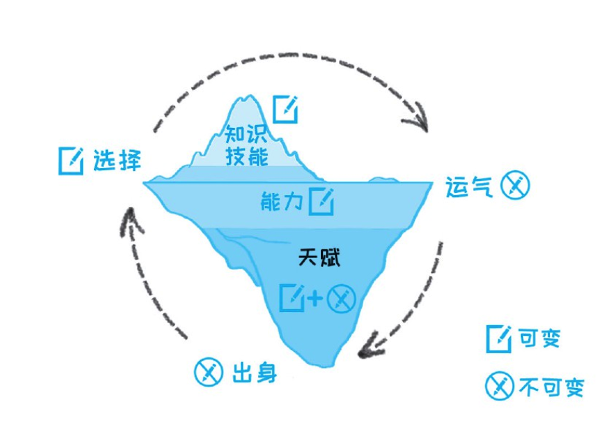
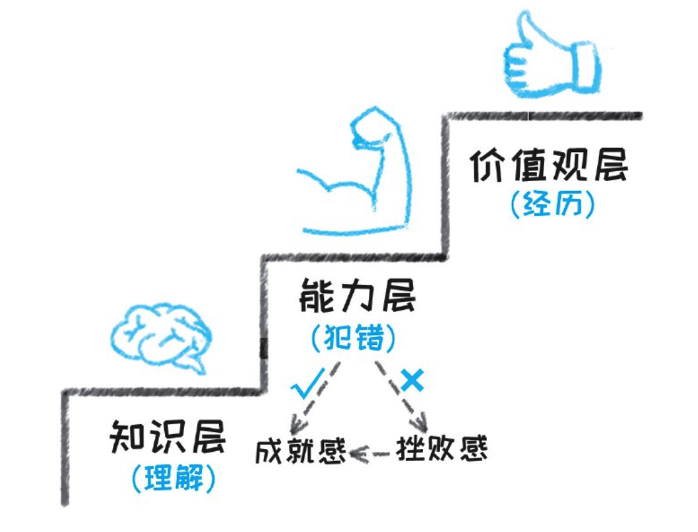
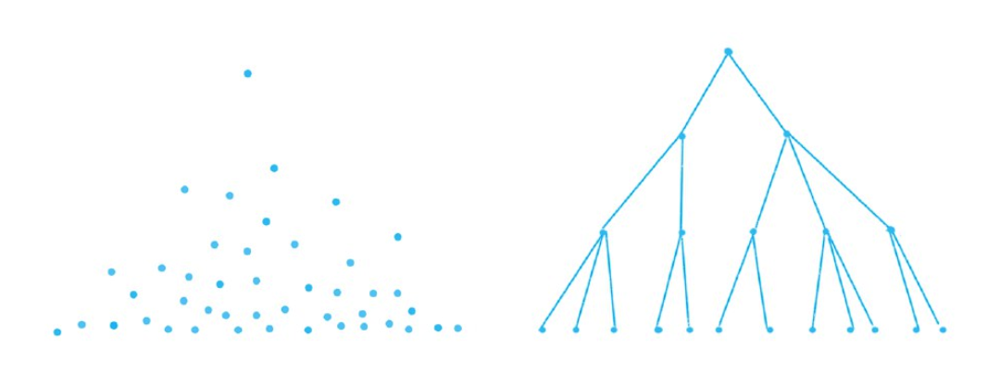
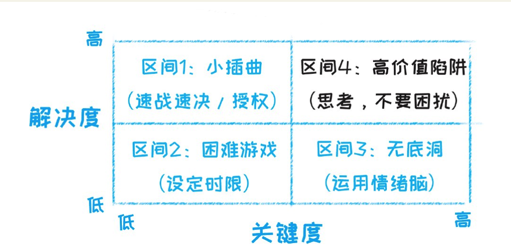
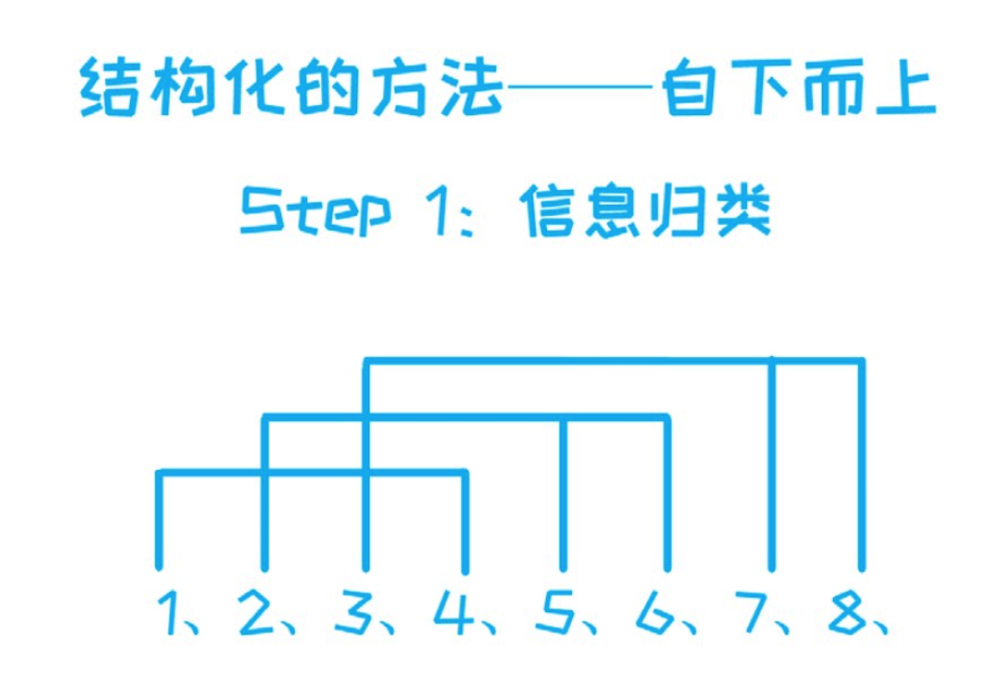
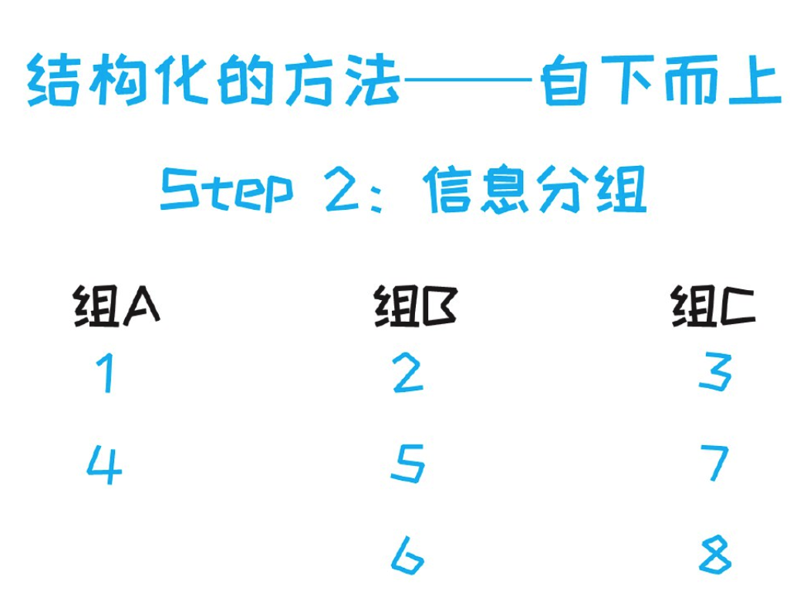

    作者: 孙圈圈 
    出版社: 团结出版社
    副标题: 如何用正确的方法快速进阶
    出版年: 2017-1-1
    页数: 296
    定价: 38.00元
    装帧: 平装
    ISBN: 9787512646759

[豆瓣链接](https://book.douban.com/subject/26936065/)

- [01 人人都有天赋 如何快速找到你的天赋优势](#01-人人都有天赋-如何快速找到你的天赋优势)
  - [你没钱，真的不是因为不努力——找到正确的定位才是关键](#你没钱真的不是因为不努力找到正确的定位才是关键)
    - [决定你的价值的六个因素](#决定你的价值的六个因素)
    - [价值定位的五种类型](#价值定位的五种类型)
    - [你的价值定位决定你的高度](#你的价值定位决定你的高度)
  - [努力，到底是不是天赋——80%的人对天赋的理解都错了](#努力到底是不是天赋80的人对天赋的理解都错了)
    - [努力，到底是不是天赋](#努力到底是不是天赋)
    - [天赋到结果之间，有多少条岔路](#天赋到结果之间有多少条岔路)
    - [大部分人，都在挥霍自己的天赋](#大部分人都在挥霍自己的天赋)
  - [别再挥霍你的天赋了——觉得自己没天赋，是因为你没方法](#别再挥霍你的天赋了觉得自己没天赋是因为你没方法)
    - [如何快速发现自己的天赋](#如何快速发现自己的天赋)
      - [1.日记](#1日记)
      - [2.问自己](#2问自己)
      - [3.问他人](#3问他人)
    - [将弥补劣势的时间，花到使用天赋上](#将弥补劣势的时间花到使用天赋上)
    - [如何练习才能将天赋转化为能力](#如何练习才能将天赋转化为能力)
- [02 学习如何学习 如何将知识转化为能力](#02-学习如何学习-如何将知识转化为能力)
  - [学习的正确姿势——靠意志力的学习，都是耍流氓](#学习的正确姿势靠意志力的学习都是耍流氓)
    - [如何快乐地学习](#如何快乐地学习)
    - [按需学习才能更有动力](#按需学习才能更有动力)
    - [提升元认知策略，让学习更有成就感](#提升元认知策略让学习更有成就感)
    - [用成就感替代挫败感](#用成就感替代挫败感)
  - [建立自己的知识体系——为什么你有海量信息，却解决不了现实问题](#建立自己的知识体系为什么你有海量信息却解决不了现实问题)
    - [网络时代我们应学些什么](#网络时代我们应学些什么)
    - [如何建立知识体系](#如何建立知识体系)
- [03 构建思维能力 让烦恼变成真正有效的思考](#03-构建思维能力-让烦恼变成真正有效的思考)
  - [正确定义问题，减少无用功——认清六个问题，节省80%的无用功](#正确定义问题减少无用功认清六个问题节省80的无用功)
    - [方向找错了，那你只有苦劳而没有功劳](#方向找错了那你只有苦劳而没有功劳)
    - [不是所有问题都是真正的问题](#不是所有问题都是真正的问题)
    - [不是所有真正的问题都值得被解决](#不是所有真正的问题都值得被解决)
    - [如何快速找到有价值的问题](#如何快速找到有价值的问题)
  - [“活的思维”与“死的知识”——清晰的思维不是无法培养的](#活的思维与死的知识清晰的思维不是无法培养的)
    - [结构化思维比你想象得重要一万倍](#结构化思维比你想象得重要一万倍)
    - [结构化思维是最值得刻意训练的能力](#结构化思维是最值得刻意训练的能力)
    - [如何拥有结构化思维](#如何拥有结构化思维)
    - [找结构的一些技巧](#找结构的一些技巧)
  - [跳出固有思维——为什么有些人条理清晰，却没有洞见](#跳出固有思维为什么有些人条理清晰却没有洞见)
    - [刻意练习获得创造力](#刻意练习获得创造力)
  - [我们的独立思考：既不独立，也不思考——你以为的“真相”，其实只是“立场”](#我们的独立思考既不独立也不思考你以为的真相其实只是立场)
    - [多数时候，我们在乎的只是观点，而非事实](#多数时候我们在乎的只是观点而非事实)
    - [独立思考，远比想象中困难](#独立思考远比想象中困难)
    - [独立思考的最佳方式是提问](#独立思考的最佳方式是提问)
    - [除此以外，我们还需要注意这些](#除此以外我们还需要注意这些)
- [04 提升沟通能力 如何成为高段位沟通者](#04-提升沟通能力-如何成为高段位沟通者)
  - [为什么你总是有口难言——如何做好临场发言](#为什么你总是有口难言如何做好临场发言)
    - [如何让你的演讲信息结构化](#如何让你的演讲信息结构化)
    - [如何讲好主题](#如何讲好主题)
    - [如何找到架子](#如何找到架子)
  - [如何愉快地闲聊——聊天不是为了得出一个正确答案](#如何愉快地闲聊聊天不是为了得出一个正确答案)
    - [如何控制聊天长度和节奏](#如何控制聊天长度和节奏)
  - [说事实不如讲故事——你很难说服人，是因为你没用这个套路](#说事实不如讲故事你很难说服人是因为你没用这个套路)
    - [如何控制聊天长度和节奏](#如何控制聊天长度和节奏-1)
  - [拓展弱联系——最有价值的信息和资源并非来源于好朋友](#拓展弱联系最有价值的信息和资源并非来源于好朋友)
    - [弱联系与强联系的不同角色](#弱联系与强联系的不同角色)
- [05 选择合适平台 借助平台成就不可取代的自己](#05-选择合适平台-借助平台成就不可取代的自己)
  - [职业规划应规划什么——90%的人不会做职业规划](#职业规划应规划什么90的人不会做职业规划)
  - [个人商业模式画布——像企业一样，给自己做规划](#个人商业模式画布像企业一样给自己做规划)
  - [主副业选择——如何成为斜杠青年](#主副业选择如何成为斜杠青年)
  - [你的高度=自身价值+平台高度——借助平台的正确姿势](#你的高度自身价值平台高度借助平台的正确姿势)
  - [抓住机会，才能弯道超车——如何利用企业资源来提升个人价值](#抓住机会才能弯道超车如何利用企业资源来提升个人价值)
- [06 破除思维定式 哪些思维方式会终生阻碍你](#06-破除思维定式-哪些思维方式会终生阻碍你)
  - [努力和结果之间并非线性关系——如何拥有一个高性价比人生](#努力和结果之间并非线性关系如何拥有一个高性价比人生)
  - [牢牢困住大部分人的错误意识——如何才能不做纸牌魔术里的观众](#牢牢困住大部分人的错误意识如何才能不做纸牌魔术里的观众)
  - [别给自己贴标签——长期的标签将成为一个自证预言](#别给自己贴标签长期的标签将成为一个自证预言)
- [07 回归真实的自己 善用情绪，才能掌控人生](#07-回归真实的自己-善用情绪才能掌控人生)
  - [情商的真正意义——情商不只是对别人,更多是对自己](#情商的真正意义情商不只是对别人更多是对自己)
  - [如何应对自己的功利心——上进是一种高发慢性病](#如何应对自己的功利心上进是一种高发慢性病)
  - [如何与性格“缺陷”和平相处——性格很难改变，那要怎么活下去](#如何与性格缺陷和平相处性格很难改变那要怎么活下去)

## 01 人人都有天赋 如何快速找到你的天赋优势
### 你没钱，真的不是因为不努力——找到正确的定位才是关键
1. 你个人能够创造出多大的价值，离不开三大`内在要素`：第一个要素，知识和技能。第二个要素。能力，比如学习和思考能力、人际交往能力等等。第三个要素，天赋，包括潜在能力、性格特质、动机、价值观。
2. 决定你最终能够收获多少回报的，除了内在因素之外，还有三大`外在因素`：出身、选择、运气。
3. 个人价值定位有五种不同的类型：投机型、知识型、技能型、能力型、天赋型。
4. 在五种不同的价值定位类型中，最优的选择有两个，一是提升能力，二是不断认识自己、发掘自己的天赋。
5. 大多数人没有采取最优选择，而是将自己定位在知识型和技能型，原因是：第一，知识和技能型最容易提升。第二，受限于岗位的定位。
6. 如果想要收入更高，你需要在学习新知识的时候，内化成能力。有技能的，需要找到稀缺技能。当然，这种稀缺性只能维持一段时间，一旦供求达到平衡之后，收入就会下降。能力，才是长久需要提升的，因为世界变化太快，只有能力是各种岗位间通用的。同时，要不断尝试和总结，发现自己的天赋。

#### 决定你的价值的六个因素
你的收入不完全是你能创造的价值，这其中，是存在一个差值的。用公式表示就是：

你的实际价值又取决于什么呢？这里有一个基础模型，称为冰山模型：

说完了内部因素，我们简单看一下外部因素。外在因素也包括三个方面：出身、选择、运气。

#### 价值定位的五种类型

刨除不可变因素，我们可以把个人所选择的定位（也可以称之为增值方式）分成五种不同的类型：投机型、知识型、技能型、能力型、天赋型。

#### 你的价值定位决定你的高度
- 投机型：追求账面价值最大化。目前的人才市场，还不是一个信息完全对称的市场。所以，同等能力，可能A 企业支付1 万，B 企业支付1.2万，C 企业支付1.5 万。投机型的人竭尽全力，通过各种渠道，找到愿意支付更高价格的地方，不惜频繁跳槽。这类人，天花板很明显，就是企业愿意为他们所支付的最高价格。
- 知识型：或许你觉得知识很值钱？但事实并非如此。为什么呢？
  - 其一，当今社会，你想知道什么，网上搜索就可以了，或者通过社交网络找到那个领域的人就可以了，可替代性太高。你就算把《百科全书》背下来，最后还得靠卖记忆力课程赚钱。
  - 其二，知识跟思维，是有差别的。现代社会，随便一个人，知识储备都超过孔子、老子、亚里士多德……但你为什么还在学他们的思想？所以，起作用的不是知识，而是思维。不能内化为能力的知识，是很难为你增加财富的。
  - 另外，你可能会想，“逻辑思维”难道不是贩卖知识吗？是的，可罗振宇能贩卖知识，靠的是他的商业运作能力。
  - 所以，**不能结合思维能力的知识，价值是很低的**。
- 技能型：技能型跟知识型其实有点类似，你能想到的最典型的技能型应该是操作工，熟练地修理仪器、操作机器。
  - 技能型的人的天花板是，企业愿意为技能付的钱，而这取决于该技能在市场上的稀缺性。
- 能力型：比如一些做专业服务类以及管理类工作的人，其定位基本是能力型的。比如咨询顾问，每天用PPT，但不会有谁是因为PPT 用得好而成为一个好顾问的。恰恰相反，一些PPT 用得一般，但能力很强的人，也没有因此太影响职业生涯。
  - 技能不行，能力可以弥补，但能力不行，技能无法代替。能力型的人，天花板往往是他们自己，而不是外在的限制。
- 天赋型：比如搞艺术、做设计的，同等努力的情况下，最终能够做得比一般人好的人，个人价值定位常常是天赋型的。

从这张图可以看出来，**想要获得更高的回报，最优的选择有两个，一是提升能力，二是不断认识自己、发掘自己的天赋**。

总之，如果想要收入更高，你需要：

1. 在学习新知识的时候，内化成能力。
2. 有技能的，需要找到稀缺技能，当然，这种稀缺性只能维持一段时间，一旦供求达到平衡之后，收入就会下降。
3. 能力，才是长久需要提升的，因为世界变化太快，只有能力是各种岗位间通用的。
4. 同时，要不断尝试和总结，发现自己的天赋。

### 努力，到底是不是天赋——80%的人对天赋的理解都错了
1. 每个人都有自己的相对天赋，正确运用天赋，可以让我们事半功倍。
2. 天赋包括`能力天赋`和`意愿天赋`，所以，在总结和反思自己的时候，要回顾这两点。
3. 能力天赋只代表潜力，要转化为能力，还需要刻意练习。
4. 正确运用天赋需要做到：找到天赋差异性大且决定性强的领域，掌握正确的刻意练习的方法，找到能有更多自主感、胜任感、归属感的工作以维持热情，坚定地拒绝那些世俗眼中的光鲜追求，避免选择那些容易埋没天赋的工作。

#### 努力，到底是不是天赋
误区一，认为天赋是能力：但实际上，天赋只是潜力。

所谓`天赋`，指的是某种天生的特性，让一个人可以在同样起点的情况下，比一般人更加快速地成长。也就是说，在某个领域内天赋高的人与该领域里的一般人，他们的努力与水平之间的关系，类似于下图两条实线。

误区二，天赋不行，努力来补：但实际上，努力也是一种天赋，天赋包括能够帮助一个人更快速成长的所有天生特性。而一个人要能够更快地成长，其实需要两个要素，一是能力方面的天赋，也可以称为潜力；二是意愿方面的天赋。

从这个角度来说，“努力也是一种天赋”这句话就有其合理性了。因为，努力代表着一种意愿，背后是由性格、动机、价值观等等来决定的，而这些都是天生的特性。

误区三，天赋离一般人很远：但实际上，每个人都有天赋。

#### 天赋到结果之间，有多少条岔路
我们就需要先来看看，天赋跟结果之间，是怎样一种关系，我用树形图来做个分解。

#### 大部分人，都在挥霍自己的天赋
挥霍方式一：用错地方。

综合这两个维度来看，你的天赋需要用在这样的领域：第一，这个领域内，是否有这项天赋，是否会导致较大的差异化；第二，该天赋是该领域的关键成功要素。

挥霍方式二：缺乏正确的方法。

一万小时天才理论中，我们往往过于关注“一万小时”，常常忽略了这一万小时的具体内容，那就是“正确的刻意练习方法”。

所以，掌握不了正确的刻意练习方法，天赋是很难变成能力的。

挥霍方式三：缺乏热情的滋养，开发动力不足。

维持刻意练习的热情，才有可能让我们一直进行这项艰辛的活动。可是，热情从哪里来呢？很多人都认为是爱好，实际上，爱好是被扭曲最多的一个概念。

热情并不来源于爱好。根据自我决定理论，热情来源于自主感、胜任感、归属感。

挥霍方式四：被世俗需求扭曲。

挥霍方式五：被后天环境埋没。

一个内容单一且每天重复的工作，会导致你主动思考能力的下降；一个流程非常规范和标准的工作，会导致你挑战和克服困难精神的丧失；一个每天跟机器打交道的工作，会导致你社交能力的减弱；一个不鼓励自主学习、主动担责的工作，会导致你失去努力的内在动力……这些，都是后天工作环境对一个人能力的影响。

### 别再挥霍你的天赋了——觉得自己没天赋，是因为你没方法
1. 天赋包括能力天赋和意愿天赋，所以真正的天赋是让你感觉自己更强大的东西。
2. 天赋有四个特征，分别是自我效能、本能、成长/ 专注和满足。
3. 探索天赋有三个方法：写日记记录内在感受，问自己有关自我效能、本能、成长/ 专注和满足的问题，以及问别人关于自己的特质。
4. 将弥补劣势的时间，重新分配到最大化你的天赋上面，才能事半功倍。具体方式是，思考三个可能性：停止、合作、替代。
5. 刻意练习是指：为了掌握某种能力，有意识地付出努力，投入到某项活动中。
6. 正确的刻意练习要符合四大特征：在学习区练习、大量重复、持续获得有效反馈、专注。学习区位于舒适区和恐慌区中间，是刻意练习的最佳区域。

#### 如何快速发现自己的天赋
天赋有四个特征，简称为“SIGN”：

- 特征一，自我效能（Self-efficacy）。对自己可以完成某项工作或任务的自信程度。比如，每当面对细节琐碎的事情时，还没开始，我就觉得自己做不好，但每当要我去解决一个难题时，我会充满信心。
- 特征二，本能（Instinct）。当你还没开始做这件事的时候，你就迫不及待地想要开始了。比如，当我把整理的东西决定要开发成为课程、教给别人的时候，我会感到异常兴奋。
- 特征三，成长/ 专注（Growth）。当你做这件事的时候，你充满好奇，十分专注，时间过得很快。比如，当我为了写文章，去阅读大量相关资料的时候，一上午对我来说，就跟20 分钟一样。
- 特征四，满足（Needs）。做完这件事之后，就算感到疲劳和困倦，你依然会有满足感。比如，每次写文章的时候，我都累到不想再继续了，然而写完之后，又觉得充满了成就感。

##### 1.日记
具体做法是：找出一周时间，在这一周里，记录自己的每个瞬间，包括兴奋、有成就感、愉快的瞬间，以及沮丧、无助、反抗的瞬间。不仅仅是工作相关，还有业余生活的部分。

你需要记录的是来自于自己内在的感受，以及非欲望的部分，比如下表中所举的例子：

一周之后，你应该会得到上百个有效瞬间，然后，结合这些让你感到强大的瞬间，去对照天赋的几个特征，筛选出跟你天赋相关的瞬间，总结共性、发现天赋。

##### 2.问自己
- 第一类问题：自我效能相关
  - 你认为，自己能够教别人什么？或者，别人常常向你请教什么？
  - 你跟他人聊天的时候，倾向聊什么？以及，聊什么话题你会更有自信？
  - 你在做什么事情的时候，不会感到焦虑和担心？
- 第二类问题：本能相关
  - 你在做什么事情的时候，很少拖延？
  - 长时间休假后，你最想念工作的哪个方面、哪个内容？
  - 你宁愿放弃休息时间，也要做的事情，是什么？
- 第三类问题：成长/ 专注相关
  - 有什么事情，让你沉浸其中忘记吃饭/ 睡觉？
  - 你在做什么事情的时候，会暂时忘记刷社交网络？
  - 你在做什么事情的时候，不容易感到疲倦和厌烦？
- 第四类问题：满足相关
  - 过去的工作和生活中，有什么能让你获得巨大的成就感和满足感？

##### 3.问他人
把这些问题发给你亲近的朋友或者同事，让他们帮你回答：
- 你觉得，我身上有什么不同于别人的特质？
- 你最欣赏或者佩服我的方面是什么？
- 在你看来，我做什么事情的时候，看起来最兴奋？
- 你曾经看到我做过哪件事情，让你印象深刻？

#### 将弥补劣势的时间，花到使用天赋上

#### 如何练习才能将天赋转化为能力
什么是正确的刻意练习方法呢？它必须符合四大特征：

1. 在学习区练习
1. 大量重复
1. 持续获得有效反馈
1. 专注

## 02 学习如何学习 如何将知识转化为能力
### 学习的正确姿势——靠意志力的学习，都是耍流氓
1. 我们的学习大多是“T”字型的：在一个领域精通就可以，而其他大多数领域，学习重点更在于了解以及建立跨领域间的联系。
2. 快乐有效的学习，要满足三点：学自己喜欢的东西、能够学得好、能给我们带来价值。
3. 在学习过程中，需要做到：按需学习、调整心态、提升元认知策略、正确犯错。
4. 按需学习：选择对我们有用、与历史过往经历匹配、能让我们参与其中、并能够应用的学习内容。长期有用的东西，需要转化成短期有用；一个大的学习内容，需要拆分出对我们最有用的部分，并集中学习这个部分。
5. 不要试图用意志力坚持学习，而要从学习本身寻求快乐。把诱惑隔离开，渐渐会学习养成习惯。学习一样东西，不需要1 万小时， 20小时足矣。
6. 提升元认知策略：每个人的认知方式不同，知道自己的认知优劣势，才能够制定适合自己的学习方法。通过筹划、选择、联系、调整、追踪的五大技巧，来提升自己的学习效率。
7. 正确犯错：人类的大脑是从犯错中学习的，能否从犯错中进步，决定了犯错这件事获得的是成就感还是挫败感。

#### 如何快乐地学习
要做到持续且快乐的学习，无非以下三点：

1. 我们喜欢这个学习内容，或者学习本身。
2. 我们能够学得好，能够让自己有成就感。
3. 这种学习能够帮我们带来价值。

从这三点出发，我们就可以总结出，如何让我们快乐且有效地持续学习。我概括为四点：

1. 按需学习：学习的东西是否对现阶段有价值。
2. 调整心态：对待学习的态度，决定了我们是否会喜欢它。
3. 提升元认知策略：每个人有不同的学习风格，了解自己的风格并且调整学习方法，能够大大提高学习效率。
4. 正确犯错：人类的大脑是从犯错中学习的，能否从错误中学习，决定了我们从学习中获得的是成就感还是挫败感。

#### 按需学习才能更有动力
关于成人学习有很多研究，成人教育领导人物马尔科姆·诺斯尔斯提出了成人学习的四个特点，区别于小孩子的学习：

1. 自愿。小孩学习一般是家长安排的，我们不会允许自己的孩子不上学，但成年人是有选择的，我们可以选择不学习、只娱乐。所以，成年人的学习内容，必须让我们看到紧迫性才行。
2. 经验。小孩的脑袋是空的，他/ 她可以接受任何新事物。但成年人有自己的经验，我们在学习的时候，往往会把学习内容跟经验做个对照，决定是否接受。同时，如果学习内容超出我们的经验太多，往往我们也很难看到价值。
3. 自主。相比小孩来说，成年人有更多主见。我们接受哪些信息、哪种方式，都是有自主性的。所以，我们选择的学习，应该是能让我们有参与感，而不是说教型的。
4. 行动。如果学习的东西，我们没机会应用，或者不知道如何应用的话，我们就会忘记。不管学习的内容有多好，只要不能使用，我们最终都会觉得没有价值。

所以，综合以上四点，在选择学习内容的时候，我们需要遵循的原则是：

- 原则一——有用：对我们现阶段要有用的，这个用处不一定是工作或者赚钱，也可以是让人放松等等。
- 原则二——匹配：跟我们的经验背景相匹配的，不会太粗浅，也不会太深奥。
- 原则三——参与：能够有参与感的，说教式的学习最好不要参与。
- 原则四——应用：可以应用到行动中去的，跟我们的工作、生活相结合的。

其中，对于“有用”这个原则，我们还需要注意两点：

第一，长期有用的东西，需要把它转化成短期有用：有些学习内容，短期内就可以找到用处；而另一些学习内容，对你未来是很有用的，但现阶段看不出，所以你必须创造出一个短期价值场景。

比如你要去训练思维方式，你知道它有用，但短期之内看不到效果，而且短期之内也不能让你事业上有明显提高。

那怎么办？你必须创造出一个短期的价值场景出来。比如，我就开了个公众号，规定自己每周要写一篇文章，而且必须是写方法论类的，把它作为我学习总结、反思、应用的一种方式。

这样一来，本来思维方式的反思和学习是看不到短期作用的，所以每周去总结其实是很难做到的，但我把它写在公众号里，这时读者点赞和转发就能让我非常有成就感和价值感，收到更加即时的反馈。

这样通过把长期有用变成短期有用，就可以让自己很好地坚持了下去。

第二，大的学习内容，需拆分出有用的组成部分：学吉他，需要培养乐感、学习乐理、学习理论、练习指法，等等。但是，我学吉他并不是想成为多么顶级的吉他手，只是为了排遣和放松，那么，会几个基本和弦，然后左手会按弦和切换，右手会扫弦，其实就够了。

#### 提升元认知策略，让学习更有成就感
我们每个人基因不同、经历不同，所以认知方式都有自己的特点和习惯。有人善于反思，有人善于行动；有人擅长逻辑，有人擅长经验；有些人喜欢一个人总结的学习，有些人喜欢大家一起学习，这些都构成了我们不同的学习风格。

“元认知”这个概念可能有点抽象，打个比方来说：我学习风格比较倾向于逻辑，平时说话也是这样，如果一个东西不符合逻辑，它再有见地，我也得把它套到一个框架当中才行。

理查德· 克拉克在1998 年提出了五种元认知技巧，或许可以让我们借鉴：

- 技巧一，筹划——学习新知识时，需要分析出必须要做的事情，比如研究一个行业，重点看其宏观环境、如何盈利、人才市场等等。并且，会据此制定计划，与什么人聊天、如何寻找资源、大概什么时间去做。而元认知差的人没有特别的规划，可能就一头扎进去了。
- 技巧二，选择——元认知能力强的人可以从杂乱无章的资料里筛选出关键要素，并时刻记住自己的目标。
元认知比较差的人，通常做法是觉得每样信息都很重要，都要去学，于是很快被信息淹没。
- 技巧三，联系——寻求新旧知识之间的联系。元认知差的人不太会联想，只会不停接收，但与自己原有的经验是割裂的。
- 技巧四，调整——分析与理解新的知识，抛弃过去有用但现在不需要的信息。
- 技巧五，追踪——能理解与应用新的知识，明确局限性，不会生搬硬套。

#### 用成就感替代挫败感
通常学习有三层：

- 知识层：学习某项内容，会某个知识点；
- 能力层：超越具体的学习内容，举一反三，应用到解决问题中；
- 价值观层：建立整体的心智模型和价值体系。

### 建立自己的知识体系——为什么你有海量信息，却解决不了现实问题
1. 技术和互联网如此发达，所以我们的学习，应该不再局限于现有知识，而更多的是探索未来的能力；不再局限于知识本身，而更多的是这些知识可以解决何种问题；不再局限于某个领域，而更多的是知识之间的联系。
2. 从学习来说，分为知识、能力和价值观三类学习。这三类内容的学习方式是不同的，倘若我们没有意识到这种不同，就会出现如下误区：
    - 误区一：知识零散化，导致信息饥渴症以及信息过载。
    - 误区二：只学价值观，忽略知识和能力。
    - 误区三：将知识与能力割裂。
3. 一个完整的知识体系，应该包括三个要素：有知识架构、有知识内容、内容之间有联系。
4. 建立知识体系的步骤：明确自己的学习背景、通过各种可靠渠道建立架构、不断修正自己的知识架构、在架构中填充知识、将知识之间以及知识与问题之间进行关联。

#### 网络时代我们应学些什么
学习无外乎三个方面：知识、能力、价值观。

- 知识的学习：具体某个领域的、用来阐述道理或解释事情或完成任务的相关信息。
- 能力的学习：这里的能力是广义的，既包括特定领域的技能，比如打篮球、写程序、画插画，也包括超越具体领域的通用能力，比如思维、沟通、计划等。
- 价值观的学习：整体的心智模型和价值体系，也就是，对事物的判断。

- 误区1 ：知识零散化，导致信息饥渴症以及信息过载
  - 你发现自己陷入了碎片知识饥渴，或者明明有很多这个领域的知识，但遇到问题还是无从下手，你就该知道，不能再吸收零散信息、而必须要建立知识体系了。
- 误区2 ：只学价值观，忽略知识和能力
  - “道、术、器”，“道”在最前，然而，“道”是你积累到一定阶段才能悟出来的，倘若没有“术”和“器”，即便知道了“道”，又有什么用？
  - 我们很多时候想一步登天地掌握“道”，其实登上的只是空中楼阁。
- 误区3 ：将知识与能力割裂
  - 这种不能转化为能力的知识，学得越多，只会让你信息过载、浪费时间、感到挫败，倒不如，就选择一个知识去学习，将它真正变成你的一部分。

#### 如何建立知识体系

从以上的图我们可以看到，零散的知识吸收，是跳跃式的、点状的、相互割裂的；而有了知识体系之后的学习，是结构化的、网状的、相互关联的。

所以，一个完整的知识体系，应该包括三个要素：有知识架构、有知识内容、内容之间有联系。

那么，如何建立出这种知识体系呢？可以遵循以下方法：

方法一，明确自己的学习背景当你刚开始学习一个领域的时候，首先要明确：你为什么学习这个领域？将来打算如何应用？这个领域跟你现有的其他知识是什么关系？

比如咨询的——影响组织效率的六大方面：

比如个人提升的——个人需要具备的技术以外的能力：

个人的专业能力提升其实也一样的，讲求“T”字型，横向上，各领域都懂一点，纵向上，找到自己赖以谋生的专业领域去深挖。

方法二，通过各种可靠渠道建立架构

在建立知识架构的时候，什么是靠谱且高质的信息源呢？答案是：专家、专业网站、经典书。

方法三，不断修正自己的知识架构

每个人的背景不同、学习目的不同，最终形成的知识结构可能也不同。

方法四，在架构中填充知识

我建议的一个方法是：

- 首先，把你看到的任何有价值的信息，都记在手机里，用什么软件都无所谓。记的时候不需要组织语言，记关键词就可以，这样最快。如果是微信文章里的，你可以直接截图保存。
- 其次，每天对当天的知识进行整理，分门别类地列到某个应用，比如Evernote 里面（如果你在上一步中也是用Evernote，那你需要分开不同的文件夹）。
- 最后，定期回顾，如果是重要的知识，再记入到知识架构里，作为知识体系的一部分，当然，这也是另一个文件夹。

方法五，将知识之间、知识与问题之间进行关联

之所以在解决问题的时候想不起用什么知识，是因为知识和问题之间是脱节的。那么，如何让知识和问题链接起来呢？答案是：二者都向对方靠。

知识向问题靠：每看到一个知识的时候，就去思考这个知识可以用来解决什么问题。

问题向知识靠：遇到任何问题的时候，不要抛开过去的知识坐着苦想，而是回到你的知识体系，去查看哪个能帮你解决问题。多次之后，你就知道某类问题该用哪类知识解决了。

## 03 构建思维能力 让烦恼变成真正有效的思考
### 正确定义问题，减少无用功——认清六个问题，节省80%的无用功
1. 大部分工作，需要的都是功劳，而不是苦劳，所以，“做什么事”，比“怎么做事”，可能更重要。
2. 不是所有的问题都是真正的问题：表象问题跟真正问题之间，存在三种偏差。
3. 不是所有真正的问题都值得被解决：因为大部分问题，花多少时间，结果都是一样的。
4. 在开始解决问题之前、或者耗时很久却毫无进展的时候，看一下文中提到的6 个问题的清单，也许会豁然开朗。

#### 方向找错了，那你只有苦劳而没有功劳
我们的工作，大致可以分为两种类型，一种是过程导向型，一种是结果导向型。

过程导向型的工作，比如产线操作工，只需按照流程，按部就班地做事情就好，人与人之间创造的价值差别不大。所以，这些岗位的市场价值也就基本固定。

对于过程导向的岗位来说，想要多产出价值，通常就是多花时间，因为单位时间的价值基本是固定的。

可结果导向型的工作不同，比如销售、程序员、工程师，等等，同样工作8 小时，你能创造更多价值、更高绩效，就有机会拿到更多回报，收入会非常悬殊。

如何找到真正值得解决的问题呢？只需要记住两点：第一，不是所有的问题都是真正的问题；第二，不是所有真正的问题都值得被解决！

#### 不是所有问题都是真正的问题
我们所看到或者听到的问题，其实只是表象问题，而表象问题跟真正问题之间，还差了三条街，也就是三种偏差。

- 第一，理解偏差（常常出现在别人要你解决问题的时候）——所以要提问
如果这个问题是别人提出的，那么就会存在双方的理解偏差，你需要跟对方澄清真正的问题，而澄清的方法，就是向对方提问。
  - 比如我上面说的关于行研的问题，如果现在让我重来的话，我会澄清这些信息：背景、目的、展示对象；可用资源（信息资源、人手资源等等）；篇幅以及必需的分析维度；何时需要初稿和终稿，等等。
- 第二，隐藏偏差（常常出现在与他人产生冲突的时候）——所以要挖掘
  - 每个人都有自己的社会角色，所说未必是所想，所以，当你面临与人冲突的问题时，不要急着解决表面问题，而要去挖掘别人内心的真正需求，从而找到真正的问题所在。
- 第三，成因偏差（常常出现在解决商业性问题的时候）——所以要分析
  - 很多问题，其实背后是有原因的，如果不能把原因找出并解决，问题会不断暴露，所以，我们要搞清楚成因，解决根本问题，而不是只解决表象问题。

#### 不是所有真正的问题都值得被解决

- 区间1，解决度高、关键度低——小插曲：这个区间通常是最容易对付的问题，通常不会困扰你。
- 区间2，解决度低、关键度低——困难游戏：这个区间的问题，就好像一个困难的游戏，通关几乎不可能，但这事儿没那么重要。
- 区间3，解决度低、关键度高——无底洞：这是很多人容易陷入的无底洞。
  - 因为关键度高，所以你会觉得要多花时间、需要非常谨慎，可是，问题的解决度明明很低。比如股市，关键度很高，可你天天挂在心上、天天研究，跟不研究比起来，结果也不会有多少差别。
  - 将时间花在这些问题上，同样是一种浪费。并且，长久将自己陷在这个区间不能自拔，会导致自己毫无成就感、更加焦虑。
  - 对于这类无底洞的问题，倒不如调用你的情绪脑，听从内心的直觉，而不是陷入理性分析中无法自拔。
  - 因为，在面临一些极其复杂的问题时，信息量会超过人脑可处理的信息量，这时候，我们的情绪脑反而比理性脑更加靠谱。
- 区间4，解决度高、关键度高——高价值陷阱：这个区间才是我们要花时间的地方，花时间解决可以产出结果、价值又高的事情。但是，这里也会有陷阱。
  - 因为重视，很多人总会在内心漫无目的地反复思量，却不会行动。你以为自己在思考和解决问题，其实只是在困扰和焦虑中耗费精力。
  - 比如，很多人对现状不满，想要转行，于是每天都在思考：我该转什么行呢？期望哪天灵光乍现，找到自己毕生愿意为之奋斗的事业。但说实话，按这种方式想下去，一辈子也很难有结果，因为这根本不是思考，只是困扰。
  - 真正的思考，是你需要收集信息、自我剖析、咨询他人、分析各种可能、最后进行选择。职业选择的问题，本书也会进行阐述，你可以按照方法进行真正的思考。
  - 所以，面对高价值问题的时候，你唯一需要注意的是：思考，而不是困扰。
  - 如果你意识到自己只是在困扰（通常的表现为：反复思量、毫无进展，而且你知道这样下去根本找不到答案），马上停止下来，避免落入陷阱。

#### 如何快速找到有价值的问题
实际上，找到高价值问题并不难，你只需要养成一个习惯，在看到问题之后，不要马上解决，而是拿出我提供的这个清单过一遍。

- 清单问题1 ：澄清需求——我是否清楚该问题/ 任务的背景、目的、关键利益方、可用资源、时间要求？
- 清单问题2 ：挖掘诉求——对方为什么会提出这样的问题/ 挑战？ ta 的真正诉求是什么？这个诉求还可以通过什么方式实现？我可以怎么帮助ta实现？（若不是跟人相关的问题，此条可略过）
- 清单问题3 ：找准问题——这个问题解决了，事情就会都顺利了？我解决的只是表象问题、还是真正成因？
- 清单问题4 ：确定关键——这个问题现在是否必须被解决？是否有其它更加重要的问题需要我去花时间？
- 清单问题5 ：确定可行——这个问题现在是否可以被解决？我解决这个问题大概需要多久？这个时间是否可被接受？
- 清单问题6 ：正确思考——这个问题我思量多久了？有没有进展？继续如此，是否有可能找到答案？（当你因为无法进展而苦恼的时候，问这个问题）

### “活的思维”与“死的知识”——清晰的思维不是无法培养的
1. 结构化思维是可培养且价值度高的能力，几乎是最值得刻意训练的能力。
2. 几乎不存在思维清晰、沟通不清的情况，沟通不清楚就是还没思考透。
3. 对于简单的问题，我们可以先思考结构，再填充内容。
4. 对于复杂的问题，我们可以列出所有信息，用自下而上的方法找到结构，具体方法分为四步：头脑风暴、连线分组、结构提炼、观点补充。
5. 大多数结构都是常见的类型，找不到结构的时候，可以往这些常见类型上面靠：时间、空间、三要素、二维矩阵、流程、利益相关方。

#### 结构化思维比你想象得重要一万倍
如果我们在解决问题、面临选择以及与人沟通的时候，能够找到一个结构，将所有的碎片信息放进去、进行归类，就能够大大减轻大脑的负担，更容易地解决问题。而这，就是所谓的“结构化思维”。
它的作用在于：

1. 帮助我们更全面、更系统地思考，将复杂的问题简单化。
2. 方便我们与人沟通，让他人更好地理解我们的意思。有些人常说自己沟通能力差，其实本质上不是沟通问题，而是思维问题，几乎不存在思维清晰但是沟通不清的人，因为思维也是沟通的一部分。
3. 互联网时代，信息都是碎片化的，如果没有结构化思维，信息只是信息，可如果有了结构化思维，就能够建立起自己的知识体系，有利于我们在解决问题的时候调用大脑中的相关信息。

#### 结构化思维是最值得刻意训练的能力
如果我用一个两维矩阵来分析的话，可以看到，结构化思维能力，是既能够被培养同时价值度又高的能力。

#### 如何拥有结构化思维
当你面临一个难题的时候，该如何去寻找结构呢？这里给出两种方法：一种是自上而下地找结构，一种是自下而上地归纳提炼结构。

第一，自上而下找结构：思考一个框架，然后将信息或解决方案放入框架。

第二，自下而上归纳总结成结构：当你不清楚可以用什么框架的时候，四种方式把信息结构化.第一步，头脑风暴。拿一张A4 纸，横过来，把你脑中关于这个问题的所有碎片想法都列出来。并且，当你觉得都列得差不多的时候，再读一遍这些碎片想法，将类似的进行连线。

（关于上图的说明：为了画图方便，图上是将想法横着排列了。实际上，你在A4纸上列碎片想法的时候，这些想法是纵向排列的，更便于你思考。）

第二步，连线分组。根据连线的情况，将想法进行分组。并且，在分组之后，总结一下每组思想的共性，便于下一步提炼结构。

第三步，提炼结构。看一下这些分组，是否存在某种规律，比如时间顺序、空间顺序、重要性顺序等等，按照这样的规律，是否需要补充或调整。

这一步需要用到`MECE`（Mutually Exclusive, Collectively Exhaustive，即相互独立、完全穷尽）原则，来决定分组调整。也就是说，对于你的论述主题，这些分组完全可以代表，同时，这些组之间又不会存在相互包含及重叠。

第四步，完善观点。确定了结构之后，看每个结构之下是否还需要补充其他信息，最后完善思路。当然，当你完成了这些信息和观点的结构化之后，你还需要完善一下你的主题。

#### 找结构的一些技巧
给出两点最重要的技巧：

第一，通过常见结构类型来推导结构：你会发现，很多结构其实都很相像。

我按照使用频率，列了一些思维结构类型，有一些是非常常见的。

简单的：时间、空间，等等。

- 三要素类： 比如，3C 战略三角（Corporation 公司，Customer 顾客，Competition 竞争对手）。
- 二维矩阵类：比如前面提到的任务分析矩阵（紧急性、重要性）。
- 流程类：比如产品价值链（研发、设计、采购、生产、营销、服务，等等）。
- 利益相关方类：比如波特五力模型（影响企业竞争战略的五种力量：现有竞争者、潜在竞争者、替代品、供应商、购买者）。

第二，通过学习知识来积累结构，将知识内化为能力。

### 跳出固有思维——为什么有些人条理清晰，却没有洞见
1. 逻辑严密的垂直思维存在局限性，而天马行空的水平思维，会让你更有创造力。
2. 创新解决问题的五字诀：信、放、虑、收、行。
3. 开脑洞（放）的正确姿势：6W 问题、SCAMPER、重新表述问题、反向问题、用比喻、随机输入。
4. 解除思维限制、打开脑洞之前，先解除外在标签对自我的限制，承认自己的多样性。

#### 刻意练习获得创造力
为了便于理解，整个流程我总结成了五字诀“信放虑收行”，如下图：

- 信：从观念上、信息上做好创造的准备。
- 放：将自己的思维信马由缰地放出去，打开脑洞。
- 虑：过滤掉那些不靠谱的想法。
- 收：将思维收回来，进行整理归纳，形成方案，这一步，我们用到的是之前提到的结构化思维。
- 行：执行和跟进。

### 我们的独立思考：既不独立，也不思考——你以为的“真相”，其实只是“立场”
1. 大部分时候，我们本能地喜欢与己相同的观点，却不爱追究真正的事实。
2. 独立思考本质上是一种批判性思维，但我们常常很难做到，因为这种思维是反直觉的、思考的结果可能是令人沮丧的、而且我们的教育并未着重培养这一思维。
3. 社会日益复杂、信息日益爆炸，倘若我们不具备独立思考的能力，将会一直处于“一觉醒来价值观就会被颠覆”的动荡中。
4. 关于“世界是什么”的议题称为描述性议题，关于“世界应该是什么”的议题称为规定性议题。
5. 描述性议题的结论如果正确，可以称为“事实”，而规定性议题的结论，称为“观点”。
6. 问题的论述应当包括以下要素：论题、理由、结论、逻辑、证据/ 事实、假设。
7. 当我们对一个论述展开独立思考的时候，通常可以思考这些问题：逻辑是否存在漏洞，导致给出的理由推导不足以推导出结论；存在何种隐藏的价值观假设，该价值观你是否认可；证据/ 事实是否足以支持理由；是否隐藏/模糊不利证据或事实。
8. 在培养自己独立思考能力的时候，我们还应当注意：多审视自己的第一反应，不要轻易相信下意识的判断；多从正反两方面思考问题；筛选需要思考的问题，而不是对所有问题都花同样的力气进行思考；跟独立思考的人相处。

#### 多数时候，我们在乎的只是观点，而非事实
大部分人所在乎的，从来就不是事实，我们在乎的，是观点。

所以你会看到，每次热点事件出来，各大自媒体迅速跟上，各自选取一个角度，找准他们读者群体的情绪诉求、拼命用言语煽动，为了达到最佳煽动效果，文章充斥着对事实的猜测，却鲜少有理由、逻辑和证据。

#### 独立思考，远比想象中困难
首先，独立思考是反人性、反直觉的。

独立思考本质上是一种批判性思维，而批判性思维本身就是对思维展开的思维，目的是去考量我们自己（或者他人）的思维是否符合逻辑、是否符合好的标准，它是否违背我们下意识的思维方式的。

其次，独立思考的结果常常是让人难过的。

爱笑的女孩运气不会太差；有钱的人往往不快乐；30 岁之前必做十件事；他很忙，因为他不够爱你……

这些结论完全经不起推敲，然而却迎合了我们的急切心理：人生这么复杂，如果能用一句话、一篇文章概括，那该多好。

最后，独立思考也受教育所限。

我们从小所受的教育，目的都在于让我们记住“结论”，至于论证是不是完整，这是无需讨论、甚至不可讨论的。

在此教育体制下长大的我们，几乎所有人的成长都离不开这样的过程：

刺激（外界的刺激摧毁我们的固有观念）、怀疑（怀疑自己过往坚持了多年的信念）、解构（过去的思维方式和观念终于被打破）、重建（吸收新的信息，见识更大的世界，重建思维和观念）。

#### 独立思考的最佳方式是提问
我们需要先区分几个基本概念。

1.区分基本概念

- 描述性论题（Descriptive Issues）与规定性论题（Prescriptive Issues）：
  - 有些论题，比如“牛奶是白的吗”，它的结论不以人的意识为转移，讨论的是“世界是什么”，这是描述性议题。
  - 有些议题，比如公共场所是否应该禁烟？跟个人的主观看法有关，讨论的
  - “世界应该是什么”，这是规定性议题。
  - 面对描述性议题时，我们往往可以诉诸科学、诉诸领域专家，或者等待科学进步来解决，若非专业人士，我们往往更关注最后的结论。
  - 但在面对规定性议题时，关注结论没有意义，只会变成不同立场的相互攻击，因为这些论题从来没有正确答案，我们更应关注的是整个论证过程。
- 事实（Fact）与观点（Opinion）：
  - 如果针对描述性论题的结论是正确的，我们就可以称之为事实。比如，多吃蔬菜有利于健康。
  - 而另一个说法，比如，蔬菜没有荤菜好吃，则是观点，它是规定性议题的结论，不同的人可以有不同的观点。

2.问问题

在厘清概念之后，我们需要开始去反思论述过程。一般来说，我们在论述问题的时候，应该包括以下要素：

- 论题：比如，范冰冰是不是美女？
- 理由：美女是指外表让人产生愉悦心情的女性；范冰冰外表让人心情愉悦；范冰冰是女性。
- 结论：范冰冰是美女。
- 逻辑：从给出的理由是否能够推导出结论。在这个例子里面，通过演绎推理，可以得出结论，所以逻辑非常严密。
- 证据/ 事实：除了这些要素以外，很多理由是需要证据/ 事实来证明的。
  - 比如，范冰冰的外表让人心情愉悦，这是个规定性论述，是需要证据的。
  - 我们可以说，经过对100 万网友的问卷调研，90% 的人认为，范冰冰的外表让人心情愉悦。
  - 而另外一个理由，范冰冰是女性，这是个描述性论述，只需事实来支撑就可以。
- 假设：一些理由还可能存在假设，比如，其中一个理由：美女是指外表让人产生愉悦心情的女性。但是，如果换一个人，ta 可能会说：美女还需要内心善良。所以，这是需要假设的。

综合这些要素，我对论述中容易犯的一些错误，做了个总结。不管是在反思自己还是反思他人的时候，我们都需要加以注意：

- 第一，这个理由是否能够推出结论？是否存在逻辑漏洞。
  - 常见的逻辑漏洞，不外乎以下类型：
    - 人身攻击：针对个人进行人身攻击，而非直接陈述理由。比如，针对老虎事件，一些网络文章并未直接讨论事实，而去说女游客是小三、是医闹。
    - 虚假的两难选择：明明存在两种以上的选择，却假设只有两种解决方案。比如，女游客脾气差、破坏了规则，她有责任，所以动物园就没有任何责任，也无需改善管理。这种非黑即白的错误逻辑，限制了我们的思维。
    - 相关当因果：先后发生或者存在相关关系的两件事，被强行解释为因果关系。比如，成功人士比普通人更早起，所以，你要坚持早起打卡，就离成功不远了。再比如，颜值高的人平均收入高于颜值低的人，所以收入高是因为颜值高。
    - 诉诸感情：使用强烈感情色彩的语言来分散注意力，让读者忽视论证过程。比如，“你！太！老！实！所以才没成功！”再比如，“不注意形象，活该你单身一辈子！”
    - 乱扣帽子：创造出一个简单的名词，来概括和简化复杂的事情，然而并没有真正发现原因。比如，绿茶X、心机X、独立X 以及各种衍生出来的这类词语，一旦有谁的任何行为不符合自身价值观，立马扣上这些帽子，将问题极度简化，而不去深究其它事实。
- 第二，是否隐藏了自己的某种价值观假设。
  - 理所当然地认为一种价值观凌驾于另一种价值观之上。比如，八达岭野生动物园可以自驾入园，但上海的野生动物园都是不让自驾入园的，而是必须乘坐全封闭的安全车。
  - 谁的做法更对呢？很难说。
  - 如果你认同八达岭野生动物园的做法，就是认同个人责任大于集体责任，
  - 认同上海野生动物园的做法，就是认同集体责任大于个人责任。
  - 类似的还有，公平与效率，忠诚与诚实，秩序与自由，环境与经济，竞争与合作，等等这些很难调和又没有好坏的价值观。
  - 当我们接触信息时、当我们迅速做了判断时，你需要知道，这里面究竟隐藏了一种什么样的价值观，才能够让我们有意识地接受和摒弃一些信息。
  - 并且，倘若不是常见的两难价值观，而是非常偏激的价值观，你就要警惕了，而不是在不知情的情况下一味地认同和吸收。
- 第三，证据/ 事实是否有效支撑理由。
  - 这里有个故事，或许你听过：某大公司引进了一条肥皂生产线，但是生产线有缺陷：有的肥皂盒是空的，没有装进肥皂就下产线了。于是该公司成立了一个以几名博士为核心的团队，来解决这个问题。在耗费数十万资金后，工程师们综合采用了机械、自动化、X 射线探测等技术，当有空盒经过的时候，一条机械臂会自动将空盒从产线上拿走。
  - 另外一家乡镇企业也遇到了同样的情况，管理产线的小工找来一台大功率电风扇，摆在产线旁，于是空皂盒都被吹走了，几百块的成本就解决了问题。
  - 这个鸡汤故事流传了小几十年了，文章最后得出的结论大概是：高学历没什么好骄傲的，创造力并不取决于学历高低，小工也能比博士强。
  - 我们暂且不讨论这个故事的真实性（了解肥皂包装产线的人一看就知道，这个故事有很大的漏洞），即便故事是真的，能得出这个结论吗？
  - 实际上，我们在论证的过程中，通常采用的证据是：个人经历、典型案例、当事人证词、专家意见、研究报告、数据，等等。
  - 但是，以上文章的证据除了明显捏造的故事以外，没有任何其他证据，最后却神奇地得出了人生道理和成功路径。
- 第四，是否存在故意隐藏或模糊不利证据/ 事实。
  - 新闻无需撒谎，它只需给出“部分真相”，就可以达到操纵民意的目的。
  - 在生活中，两个人吵架，我们去劝和，都会知道要听取双方意见之后再做判断和劝导，然而具体到新闻事件里，为什么我们常常听完一面之词就下了判断呢？
  - 所以，当我们看到一些匪夷所思的事件，挑动起常见的社会矛盾，而且又属于专业领域时，我们先不要盲目相信那些偏激的言论。因为我们不能确定，这背后是否隐藏了信息，是否有我们的知识所不能触及的角度。

#### 除此以外，我们还需要注意这些

1. 多审视自己的第一反应：避免先入为主，避免“我的就是比你好的”。
2. 多从正反两方面思考问题：不要轻易否定，也不要轻易肯定。
3. 筛选需要批判性思考的问题：我们不需要对每句话都进行批判性思考，倘若那样的话，我们就没法写文章、没办法说话甚至没办法生活了。
4. 跟独立思考的人相处：独立思考的人，通常有这样的特征，具有自主性、满怀好奇心、为人谦恭有礼、常常以理服人而非人身攻击。倘若我们经常跟这类人相处，便能够帮助我们养成独立思考的习惯。

## 04 提升沟通能力 如何成为高段位沟通者
### 为什么你总是有口难言——如何做好临场发言
1. 用结构化思维进行临场发言的步骤：想主题、搭架子、填素材。
2. 想主题的注意点：迅速找到一个视角，并在第一句话就抛出观点。
3. 架子有三种类型：时间架、空间架、三角架。
4. 填素材的时候，需要注意承上启下，以使听众跟着思考。
5. 如何练习：在日常生活中不断累架子；在平时工作中不断练套路。

#### 如何让你的演讲信息结构化
用结构化思维，帮助你在短时间内更好地沟通，关键是三个步骤：

- 第一步，想主题：迅速找到一个切入点，第一句就说出自己的观点。
- 第二步，搭架子：在论证观点时，思考一个结构（时间、空间、程度），并只说三点，这称为三个“架子”。
- 第三步，填素材：每个架子里，填充一些事例、数据等，来推进论据向观点靠近。

#### 如何讲好主题
首先，迅速选取一个视角。

为什么要这么做呢？

通常我们表达观点的方式可能有两种：一是全面的肤浅，二是片面的深刻。

另一方面，当你只有几分钟的发言时间时，面面俱到，无法展开，别人听起来就会觉得，你说了很多，但好像又什么都没说。

#### 如何找到架子
架子指的是：提炼出来的结构关键词。架子一方面充当提示语，有了它，你不至于一点都说不出来，另一方面又是帮你梳理信息的工具。

类型一，时间架：按照时间的顺序，把脑子里的信息整理输出举例如下：

- 问：你是做什么的？
- 答：我在一家外资企业做员工培训工作。
- 问：你平时都做些什么呢？
- 答：总体来说，我的工作是保证培训工作的顺利进行。培训前，我会联系讲师、学员、酒店等确认准备工作。培训中，我会在现场进行协调、为讲师和学员服务。培训后，我会通过学员工作场所访谈等方式跟进培训效果，今后改进。

培训前、培训中、培训后就是按照时间的顺序来说话。

时间类的架子，其实不局限于时间这个狭窄的概念，还包括一切有先后或因果顺序的结构。因此，时间类的架子可以分成以下三类：

- 代表时间的词：过去、现在、将来；上午、中午、下午；一点、两点、三点。
- 代表阶段的词：研发、试产、投产；少年、青年、壮年；前期、中期、后期。
- 代表步骤的词：第一步、第二步、第三步；流程一、流程二、流程三；首先、然后、最后。

类型二，空间架：按照地点的顺序整理思路之前关于培训的例子，如果不按照培训前、培训中、培训后来讲，按照办公室、酒店会议厅、学员工作场所这三个地点来讲，也同样可以表达出意思。

用空间架的好处是，听众脑子里很容易出现具体场景，有视觉化效果，能够更好理解你说话的意思。

举例如下：

全国各地的人们都合家团圆，一起喜迎春节。

广州：舞龙舞狮。

北京：全家一起包饺子。

南京：写春联以及贴春联。

它的结构也是一样的：主题、架子、素材。只是架子是一些代表地点的词。

接下来给大家一些空间法的架子：

- 代表地理位置：美洲、欧洲、亚洲；北京、上海、广州；实验室、流水线、4S 店。
- 代表视觉区域：外壳、屏幕、键盘；脑、肩、心。

类型三， 三角架：按照三个方面的顺序整理思路。看如下例子：

斯滕伯格的爱情三元论：激情、亲密和承诺。

按照激情、亲密、承诺的顺序说话，这种方式叫做三角法。

三角法的架子通常有以下几类：

- 代表三个方面（三件事）的词：语法、修辞、逻辑；提高沟通效果、提高影响力、
- 提高印象分；多学、多听、多练。
- 代表三类人的词：孩子、丈夫、自己；客户、员工、股东；领导、同事、下属。

三角法的最大特点是：能把一件事情客观地说清楚。

用这三种方法找架子的时候，可以尽量使用`MECE` 原则（MutuallyExclusive, Collectively Exhaustive，即，架子之间相互独立、完全穷尽），这个原则在本书之前讲结构化思维的时候也提到过，这样会给人逻辑更加严密的感觉。

### 如何愉快地闲聊——聊天不是为了得出一个正确答案
1. 如果我们跟人聊天，想让对方觉得愉快，需要：控制话题的长度和节奏、适时表达认同、与对方感同身受。
2. 聊天不是辩论、不是汇报工作，更不是为了得出一个正确答案。
3. 如何控制长度和节奏：当对方抛出话题的时候，从六大角度延展；当自己抛出话题的时候，不要抛出封闭式问题，可以是一些关于对方人生和职业经历的话题；不想继续的时候，以事情、口号或者表情来结束。
4. 如何适时表达认同：借助表情、善于倾听、赞美对方。
5. 如何表达不认同：委婉地表达、给别人期望。
6. 如何与对方感同身受：承认世界的多样性、穿上对方的鞋、暂时放下自我。

#### 如何控制聊天长度和节奏
要想很好地控制聊天长度和节奏，就需要能够自如地延展和结束话题。

1. 当对方抛出话题的时候，你该如何延展简单来说，可以从以下六个角度来思考和回应这个问题，我分别举例说明：
    - 角度一——历史：这个现象跟过去有何不同？这个现象是否牵扯到过去的某种现象对方：“今天天气不错啊！”你：“是啊，以往这个季节可是经常下雨呢。”
    - 角度二——原因：导致这个现象的原因对方：“今天小胖看起来很开心。”
        - 你：“对啊，我觉得他最近瘦了，是不是减肥成功了？还是相亲成功了？”
    - 角度三——范围：这个现象发生的范围对方：“上海的房价好贵啊，一个月5W还那么破一个地方。”
        - 你：“是啊，我看北上广现在都涨疯了。但是，二线城市明显低多了，最近也没怎么涨。”
    - 角度四——具化：把一个现象缩小到个体身上，举一个你知道的有趣的例子对方：“最近朋友圈都在晒微信运动哎。”
        - 你：“对啊，你知道吗？我朋友圈里一个人，为了占封面，把手机绑在狗身上。”
    - 角度五——影响：一个现象可能引发的一系列现象对方：“下了两个星期的雨，终于停啦！”
        - 你：“对啊，我心情都跟着变好了。还有，今天衣服应该会晒干，终于不用再去买袜子了。”
    - 角度六——未来：关于这件事情的后续进展，有没有什么措施将会采取对方：“最近恐怖袭击发生的频率有点高啊，尤其是巴黎那次。”
        - 你：“是啊，听说法国政府在考虑一些应对措施了，比如打击ISIS，减少接受难民。”
2. 当自己抛出话题的时候，有什么技巧最重要的就是：不要抛出封闭式问题。比如，“你喜欢川菜吗？”对方一般会说“不喜欢”或者“很喜欢”。但如果换个问题，“川菜为什么越来越流行”，对方就有思考和讨论的空间了。
    - 另外，还有一个重要技巧就是，在抛出话题的时候，可以是一些关于对方人生和职业经历的话题，比如问一位企业高管，“你当年是如何选择了这个行业的”，对方会有很多故事和阅历跟你分享。我们每个人，在谈论自己的时候，总会比谈论他人更加激情澎湃。
3. 当你不想继续的时候，如何优雅地结束话题的延展是一方面，但有些时候，你不想跟对方闲聊，但又不能粗鲁地打断，或者说，其实你们双方都想要结束，但你们都尊重对方，不想自己先结束。这个时候，也可以有些技巧：
    - 以事情来结束
        - 睡觉时间：“不早了，你早点回去休息吧，明天还要上班呢。”
        - 上班时间：“快到公司了，回头再聊哈。”
        - 吃饭时间：“到吃饭时间了，约了朋友，不好意思，下次再聊哦。”
        - 我的经验是，不要说一些很快能做完的事情，或者能引起新一轮话题的事情，比如你说“我要看电视剧了”，对方很可能问你“看什么电视剧啊”，然后又要掀起新一轮聊天高潮。
        - 再比如，“我下楼拿个快递”，“我回个邮件”，诸如此类的借口也不要用，否则对方很可能期待几分钟后继续。
    - 以口号式的祝福或赞美结束
        - 比如以下这些场景：
        - 对方谈论一些激动人心的想法，反复强调。
        - 你可以回应：“我觉得你的想法很棒，加油！”
        - 对方吐槽社会，翻来倒去。
        - 你可以回应：“我也觉得这特别不合理，但我相信会渐渐好起来的！”
        - 对方大倒苦水，对自己恨铁不成钢。
        - 你可以回应：“创业总是会经历低谷的，我相信你的能力，一定可以很快走出来！”
    - 以表情结束（适用于线上聊天）
        - 以表情来结束，并且不再回复其它文字。既不显得生硬，又能够适时结束。用这种方式，对方也会很容易明白。

### 说事实不如讲故事——你很难说服人，是因为你没用这个套路
1. 任何想要说服别人、激发对方情感的场合，你都需要故事，因为只有故事才能引发共情。
2. 好的故事都具备这些要素：基本要素（冲突< 渴望、障碍>、行动、结局）+附加要素（情感、展示）。
3. 商业故事与小说故事遵循同样的方法，但商业故事有四大特点：渴望是挖掘的而不是人为制造的；目的性很强所以故事是从结局倒推的；并非所有故事都需要情感；展示往往包含很多数字和案例。
4. 常见的商业故事类型：我是谁、我为什么在这儿、教育展望、我知道你在想什么。

#### 如何控制聊天长度和节奏

要想很好地控制聊天长度和节奏，就需要能够自如地延展和结束话题。

1. 当对方抛出话题的时候，你该如何延展简单来说，可以从以下六个角度来思考和回应这个问题，我分别举例说明：
    - 角度一——历史：这个现象跟过去有何不同？这个现象是否牵扯到过去的某种现象对方：“今天天气不错啊！”。你：“是啊，以往这个季节可是经常下雨呢。”
    - 角度二——原因：导致这个现象的原因对方：“今天小胖看起来很开心。”。你：“对啊，我觉得他最近瘦了，是不是减肥成功了？还是相亲成功了？”
    - 角度三——范围：这个现象发生的范围对方：“上海的房价好贵啊，一个月5W还那么破一个地方。”。你：“是啊，我看北上广现在都涨疯了。但是，二线城市明显低多了，最近也没怎么涨。”
    - 角度四——具化：把一个现象缩小到个体身上，举一个你知道的有趣的例子对方：“最近朋友圈都在晒微信运动哎。”。你：“对啊，你知道吗？我朋友圈里一个人，为了占封面，把手机绑在狗身上。”
    - 角度五——影响：一个现象可能引发的一系列现象对方：“下了两个星期的雨，终于停啦！”。你：“对啊，我心情都跟着变好了。还有，今天衣服应该会晒干，终于不用再去买袜子了。”
    - 角度六——未来：关于这件事情的后续进展，有没有什么措施将会采取对方：“最近恐怖袭击发生的频率有点高啊，尤其是巴黎那次。”。你：“是啊，听说法国政府在考虑一些应对措施了，比如打击ISIS，减少接受难民。”
2. 当自己抛出话题的时候，有什么技巧最重要的就是：不要抛出封闭式问题。比如，“你喜欢川菜吗？”对方一般会说“不喜欢”或者“很喜欢”。但如果换个问题，“川菜为什么越来越流行”，对方就有思考和讨论的空间了。
    - 另外，还有一个重要技巧就是，在抛出话题的时候，可以是一些关于对方人生和职业经历的话题，比如问一位企业高管，“你当年是如何选择了这个行业的”，对方会有很多故事和阅历跟你分享。我们每个人，在谈论自己的时候，总会比谈论他人更加激情澎湃。
3. 当你不想继续的时候，如何优雅地结束话题的延展是一方面，但有些时候，你不想跟对方闲聊，但又不能粗鲁地打断，或者说，其实你们双方都想要结束，但你们都尊重对方，不想自己先结束。这个时候，也可以有些技巧：
    - 以事情来结束
      - 睡觉时间：“不早了，你早点回去休息吧，明天还要上班呢。”
      - 上班时间：“快到公司了，回头再聊哈。”
      - 吃饭时间：“到吃饭时间了，约了朋友，不好意思，下次再聊哦。”
      - 我的经验是，不要说一些很快能做完的事情，或者能引起新一轮话题的事情，比如你说“我要看电视剧了”，对方很可能问你“看什么电视剧啊”，然后又要掀起新一轮聊天高潮。
      - 再比如，“我下楼拿个快递”，“我回个邮件”，诸如此类的借口也不要用，否则对方很可能期待几分钟后继续。
    - 以口号式的祝福或赞美结束
      - 对方谈论一些激动人心的想法，反复强调。
      - 你可以回应：“我觉得你的想法很棒，加油！”
      - 对方吐槽社会，翻来倒去。
      - 你可以回应：“我也觉得这特别不合理，但我相信会渐渐好起来的！”
      - 对方大倒苦水，对自己恨铁不成钢。
      - 你可以回应：“创业总是会经历低谷的，我相信你的能力，一定可以很快走出来！”
    - 以表情结束（适用于线上聊天）
      - 以表情来结束，并且不再回复其它文字。既不显得生硬，又能够适时结束。用这种方式，对方也会很容易明白。

### 拓展弱联系——最有价值的信息和资源并非来源于好朋友
1. 强联系，是指你们处于同一个圈子，比如一起工作、一起居住、一起娱乐，你们的相处时间较长，通常想法也倾向于相似。
2. 弱联系，是指你圈子以外的人，你认识、但不那么关心，通常建立在价值交换的基础上。
3. 弱联系的真正作用是把不同的社交圈子连接起来，从圈外给你提供有用的信息。所以弱联系理论常常应用于找工作、商业合作等信息依赖性社交事件。
4. 拓展弱联系的方法：离开舒适区、选对圈子、差异化定位、摆对态度、用好技巧、不要过于依赖人际网络。
5. 离开舒适区的方法：朋友引荐、主动建立不同圈子间的连接、找到共同话题。
6. 选择圈子的标准：与现有圈子重合度不要太高、可以为你带来价值、你可以对这个圈子贡献价值。
7. 根据你的性格、资源等，可有四种人际网络的定位：节点、专家、明星、助理。
8. 如何摆对态度：保持真诚、保持平等、记得寄予。
9. 这些技巧需要注意：根据场合来塑造外在形象、根据对象来决定你说话的时间、向对方展现能力、能力不足的时候展示潜力。
10. 不要过于依赖人际网络：别因此忽略强关系、弱关系也可以转化为强关系、投资自己比投资别人更加靠谱。

#### 弱联系与强联系的不同角色
根据牛津大学人类学家罗宾邓巴（Robin Dunbar）的研究，每个人的社交网络中，最核心的圈子有3-5 人，最为亲密。然后是12-15 人，失去他们会给你带来重创。继而是30-40 人，这是你经常保持联系的一群。然后是150人，而这150 人是人类智力允许其拥有的稳定网络的人数上限（也被称为`邓巴数字`）。

社交产品Path，规定好友上限人数不超过150，就是基于这个理论。

而根据斯坦福大学教授马克·格兰诺维特（Mark Granovetter）的研究，人际关系根据心理距离的远近，又分为`强联系`和`弱联系`。

强联系是指，你们处于同一个圈子，比如一起工作、一起居住、一起娱乐，你们的相处时间较长，通常想法也倾向于相似。

而所谓弱联系，就是指你圈子以外的人，你认识、但不那么关心，可能是朋友的朋友，或者刚认识不久的人，你们的想法常常不同。弱联系通常建立在价值交换的基础上。这里的价值指的是广义的价值，不仅仅是指经济价值。

“弱联系”的真正作用是把不同的社交圈子连接起来，从圈外给你提供有用的信息。它的本质是信息的传递，以及价值的交换。

这也就是为什么，弱联系理论常常应用于找工作、商业合作、相亲这样的信息依赖性社交事件。

总之，强联系数量，人与人之间其实不会差很多，它决定的是你的人际网络深度。而往往决定你人际网络广度的，却是你的弱联系数量。

## 05 选择合适平台 借助平台成就不可取代的自己
### 职业规划应规划什么——90%的人不会做职业规划
1. 每个职场人都需要做个人职业规划，就跟企业需要做战略规划一样。
2. 我们应该在掌握方法之后，自己做规划，而不要期待他人给出答案。
3. 职业规划的三要素：价值规划、扬长避短、关注外部。
    - 价值规划：如何通过规划，让自己的价值（知识、技能、能力）得以不断提升。
    - 扬长避短：了解自己的意愿和擅长，才知道自己接下来可以走什么路。
    - 关注外部：在进行个人规划时，外部环境是一个重要参考因素，包括行业内人才供需关系、企业组织形式变化，等等。

### 个人商业模式画布——像企业一样，给自己做规划
1. 个人商业模式画布是从企业商业模式中演变而来，因此借助它，有利于我们拔高思维高度，去思考策略层面的事情。
2. 画布共有九大因素：核心资源、关键业务、客户群体、价值服务、渠道通路、客户关系、重要合作伙伴、收入来源和成本结构。
3. 画布有三大用途：职业诊断、职业选择、职业规划。
4. 用画布做诊断的关键在于：发现因素之间的不匹配。
5. 常见的不匹配情形：关键业务跟核心资源不匹配；价值服务跟客户群体不匹配；渠道通路与客户群体不匹配。

### 主副业选择——如何成为斜杠青年
1. 任何一份职业中，我们的诉求无非是三个方面：愉悦、成就、金钱。三个诉求将职业划分为七大类型。
2. 我们很难找到一份工作，可以满足你对事业的全部幻想，就像你很难找到一个另一半，可以满足你对异性的全部幻想一样。
3. 当我们选择主业、副业、爱好的时候，选那些诉求互补的，而不是诉求重合的，否则只会让你的缺憾加倍。
4. 职业类型并非是一成不变的。当外界环境发生变化的时候，我们也应当相应调整。
5. 寻找兴趣的三个方法：多尝试、多总结、做测评。其中的总结可以使用文中的总结清单，而测评只是辅助，不可全信。
6. 享受不是兴趣，愿意付出才是；任何事情，接触皮毛的时候都不要谈兴趣；兴趣也不是爱好，而是热情的来源。
7. 寻找自己擅长领域的两种方：自我总结、他人反馈。
8. 有些能力，大部分属于天生，而有些能力，是可以通过培养来提升的。对于可培养的能力，不应当以此作为标尺去寻找职业，而应该是先提升能力，然后拓宽自己的职业道路。

### 你的高度=自身价值+平台高度——借助平台的正确姿势
1. 一切让你可以达到另一个高度的外部因素，都可以称之为平台。所以，你的高度=自身价值+平台高度。
2. 平台的主要类型：靠策略、靠宣传、靠产品、靠企业、靠老板、靠伙伴、靠家庭。
3. 在选择企业平台这件事情上，除了薪酬以外，你需要重点考虑：培养和发展机会、人脉和声誉、是否进入HIPO名单。
4. 如果你发现自己跟老板很投缘，而且他符合这些特征，那么不妨考虑一下：对未来的判断常常很准、自身能力强、关心你、善于辅导你成长、为人正直。
5. 年轻的时候，选择志同道合且能力相当的伙伴，能够互相促进。
6. 适当的时候选择合适的平台。
7. 在该长本事的时候长本事，该靠平台的时候靠平台，别搞乱了。

### 抓住机会，才能弯道超车——如何利用企业资源来提升个人价值
1. 随着交易成本的下降和管理成本的上升，企业将越来越平台化，表现为：更替、无界、联盟和分化。
2. 我们应该不断通过提问，时刻关注自己行业的发展动向。
3. 主动发现机会，利用企业资源提升自我价值，才有可能弯道超车。
4. 如果希望联盟，就去那些相对依赖人的行业。
5. 最重要的是，不只是个人，企业也应当关注这些趋势，才能留住优秀的人才。

## 06 破除思维定式 哪些思维方式会终生阻碍你
### 努力和结果之间并非线性关系——如何拥有一个高性价比人生
1. 稍加努力就可以做到60 分，但是到80 分就需要成倍的努力，到90 分则更甚。这并非是因为60 分的人聪明，而是因为，人生本来就是这样的。
2. 60 分的成绩最容易获得、性价比又高，但人数众多、僧多粥少。所以，考虑资源和人数分布的因素，性价比最高已经不是60 分了，而是90 分及以上，尽管它的风险最高。
3. 高性价比的努力方法：有所取舍，采用“T”字型的努力方式；掌握方法，别让大脑偷懒；调节情绪，清楚自己在哪个阶段，从而调整心态。

### 牢牢困住大部分人的错误意识——如何才能不做纸牌魔术里的观众
1. 我们在成长过程中，都被植入了大量错误的意识，而我们的大多数焦虑、迷茫、踟蹰、沮丧……几乎都来源于此。
2. 工作不等于付出，而生活也不等于享受。付出不等于痛苦，而享受也不等于快乐。
3. 我们追求的根本不是痛苦与快乐的平衡，而是长期快乐与短期快乐之间的平衡。
4. 人的行为受很多因素的影响，性格只是很小的一部分，只代表你对这件事的一种偏好，而不代表能否做好。
5. 面对你的天性，去做一双鞋，而不是去拔钉子。
6. 如果在每次挫折和失败之后，就进入恢复模式，理所当然地认为自己需要疗伤，那就阻碍了这些挫折和失败给我们带来的全新视角，以及让自己变得更好的斗志。

### 别给自己贴标签——长期的标签将成为一个自证预言
1. 根据自己过往的经验，给一类人贴上标签进行分类，形成一种固定看法的行为，称为“刻板印象”（Stereotype）。
2. 来源于过去的教育以及经历的刻板印象，很可能是一种偏见。
3. 贴标签的原因：对抗恐惧、抱团竞争、便利社交。
4. 我们常常以截然不同的态度对待他人：对熟悉的人，常常把他看成一个有个性的人，而对不熟悉的人，倾向于进行归类。
5. 标签的负面作用：导致消极行为、引起焦虑感、阻碍深层社交。
6. 如何避免对他人贴标签：建立意识、接触外群、见识世界。
7. 如何避免被动贴标签：了解自己、多看反例、提升地位。

## 07 回归真实的自己 善用情绪，才能掌控人生
### 情商的真正意义——情商不只是对别人,更多是对自己
1. 情商不只是如何对待别人，更重要的是如何对待自己，把情商等同于会说话，是大大的理解误区。
2. 仅谈情商没有意义，因为它是多个影响因素的结果，要有针对性地提升。
3. 长久受困于情绪，会阻碍我们进入其它层次，比如思维、价值观、愿景。
4. 应对自己的情绪：认识它——认可它而不要暴力压抑它；觉察它——叫出它的名字，明白它的特点，从而能够聆听它传递的信息；管理它——用行为疏散负面情绪，而不是用负面情绪指导行为，同时移除自己的情绪条件反射。
5. 应对他人的情绪：感知它——通过他人的身体反应和自己的换位思考来感知对方的情绪；应对它——牢记沟通目标，不要争高下、也无需做好人，而是要寻找双方的共同需求、达成共赢。

### 如何应对自己的功利心——上进是一种高发慢性病
1. 上进这个词的核心在于“上”，也就是说，比现在更好。暗含的意思就是，自己现在不够好，希望通过努力变得更好。
2. 上进跟努力是不一样的，努力是付出，而上进是结果。
3. 太过上进不仅带来情绪和心态上的负面影响，常常还会导致：不正确的自我认知、失去过程的快乐、牺牲长远发展换取短期进步。
4. 让自己别太上进的方法：放低自己，承认自己一无是处；关注内在动机而非外在动机；不要太快、效率太高；放弃那些你十分抗拒、或者努力很久而不得的东西。

### 如何与性格“缺陷”和平相处——性格很难改变，那要怎么活下去
1. 那些知道自己无法战胜天性、所以想一些其它措施弥补、避免跟天性正面对抗的人，才能坚持到最后。
2. 人在不同的成长阶段，只有放弃旧的、过时的观念和习惯，才能度过危机，顺利进入人生的下个阶段。
3. 25 岁到30 岁，是我们认清自己、发挥优势、弥补劣势的最佳时机。
