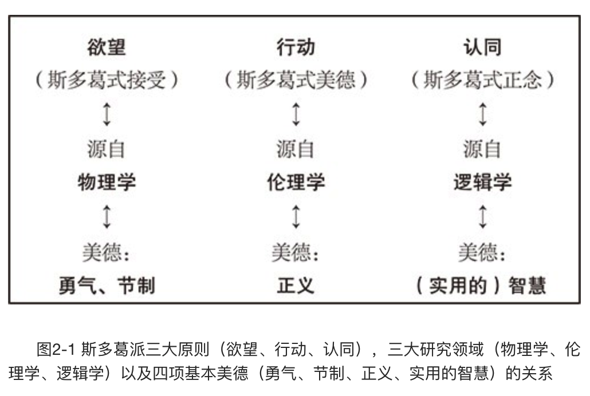

    作者: 马西莫·匹格里奇
    出版社: 未读·思想家·北京联合出版公司
    出品方: 未读·思想家
    副标题: 斯多葛哲学的生活之道
    原作名: How to Be a Stoic: Using Ancient Philosophy to Live a Modern Life
    译者: 王喆
    出版年: 2018-7-1
    页数: 224
    定价: CNY 49.80
    装帧: 平装
    ISBN: 9787559619617

[豆瓣链接](https://book.douban.com/subject/30206364/)

- [哲学的指引](#%e5%93%b2%e5%ad%a6%e7%9a%84%e6%8c%87%e5%bc%95)
  - [01 曲折之路：我们如何生活](#01-%e6%9b%b2%e6%8a%98%e4%b9%8b%e8%b7%af%e6%88%91%e4%bb%ac%e5%a6%82%e4%bd%95%e7%94%9f%e6%b4%bb)
  - [02 斯多葛哲学旅行路线图](#02-%e6%96%af%e5%a4%9a%e8%91%9b%e5%93%b2%e5%ad%a6%e6%97%85%e8%a1%8c%e8%b7%af%e7%ba%bf%e5%9b%be)
- [第一部 欲望原则：何物可求，何物不可求](#%e7%ac%ac%e4%b8%80%e9%83%a8-%e6%ac%b2%e6%9c%9b%e5%8e%9f%e5%88%99%e4%bd%95%e7%89%a9%e5%8f%af%e6%b1%82%e4%bd%95%e7%89%a9%e4%b8%8d%e5%8f%af%e6%b1%82)

# 哲学的指引
## 01 曲折之路：我们如何生活
斯多葛派学说有一条核心原则：我们应该认识并区分自己所能掌控的事情和无法掌控的事情。

斯多葛派信徒接受普遍因果律这一科学原理：一切皆有缘由，宇宙万物皆按照自然规律发展变化。他们认为，世上没有鬼神之类的超自然存在，但他们同时相信宇宙的构造必然遵循他们所谓的`“逻各斯”（logos）`。“逻各斯”可以理解为上帝，有时也可以简单称其为“爱因斯坦之神”——一个简单却毋庸置疑的事实：自然是可以用理性来解释的。

## 02 斯多葛哲学旅行路线图
尽管斯多葛派学说一开始就被设计成一种相当实用的哲学，但如果没有某种理论框架作为基础，它就无法上升为“哲学”。这一框架就是——过上（幸福论意义上的）好的生活，人们必须了解两件事：世界的本质（引申开来还包括个人在世界中所处的位置），以及人类理性的本质（包括理性何时会失效，因为这种情况十分常见）。

首先，欲望原则（也被称作斯多葛式接受）告诉我们追求什么是合适的，追求什么是不合适的。之所以这么说，是因为有些事情在我们能力范围之内，有些在我们能力范围之外。我们只要对世界如何运作有所了解，便能领会这一关键区别，因为只有没受过物理学教育的人才会产生错觉，认为他们能够掌控自身能力之外的东西（也就是盲目乐观）。在斯多葛派四种美德中有两种和控制欲望相关：（面对事实并采取相应行为的）勇气和（管控欲望，使其同我们力所能及之事相匹配的）节制。

其次，行动原则（从关爱他人的意义上说，也叫斯多葛式美德）告诉我们在这个世界上该如何做人。它源于对伦理学的充分理解，伦理学所研究的是如何生活，依凭的美德是正义。

最后，认同原则（或称斯多葛式正念）告诉我们如何应对各种状况——对我们的第一印象采取认同或否定的态度。这一原则是通过研究逻辑学——怎样思考合理，怎样不合理——而得出的，依凭的美德是实用的智慧。

# 第一部 欲望原则：何物可求，何物不可求

